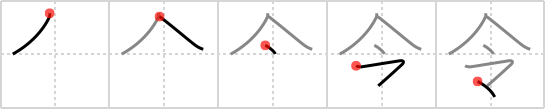

## `orders`

## [5]

## Reading:

### On-Yomi: レイ

## Heisig story:

Meeting . . . chop-seal.

## Premitive:

chop-seal The chop-seal is the engraved piece of wood or stone used in the Orient to certify documents. Unlike the stamp, the top stroke here reaches a good distance to the left of its vertical stroke. When it appears at the top of another primitive, it is abbreviated to n. [2]

## Koohii stories:

1) [<a href="http://kanji.koohii.com/profile/akrodha">akrodha</a>] 30-4-2007(208): (re: dingomick) &quot;These are your<strong> orders</strong>,&quot; declares the general while passing out documents at the <em>meeting</em>. As everyone started to leave, the general exclaims &quot;Oh wait! I need to certify these<strong> orders</strong>!&quot; and went around stamping each paper with his personal <em>chop-seal</em>.

2) [<a href="http://kanji.koohii.com/profile/dingomick">dingomick</a>] 28-2-2007(73): &quot;These are your <strong>orders</strong>,&quot; declares the general at the <em>meeting</em> as he stamps them with his <em>chop-seal</em>. (Primitive: chop-seal imaged as a papal ring, the one&#039;s they would press into wax as their official seal. Also a cattle brand.).

3) [<a href="http://kanji.koohii.com/profile/MeisterLlama">MeisterLlama</a>] 29-4-2009(52): Take note that this is written differently from how it looks in the typed font. See: <a href="http://kakijun.main.jp/">http://kakijun.main.jp/</a> for the next kanji or <a href="http://www.saiga-jp.com/cgi-bin/dic.cgi?m=search&amp;sc=0&amp;f=0&amp;j=%E4%BB%A4&amp;g=&amp;e=&amp;s=&amp;rt=0&amp;start=1&amp;sid=1240981825_91321">http://www.saiga-jp.com/cgi-bin/dic.cgi?m=search&amp;sc=0&amp;f=0&amp;j=%E4%BB%A4&amp;g=&amp;e=&amp;s=&amp;rt=0&amp;start=1&amp;sid=1240981825_91321</a>, for example.

4) [<a href="http://kanji.koohii.com/profile/lerris">lerris</a>] 4-7-2007(36): I assigned this the primitive meaning of President Bush, giving crazy<strong> orders</strong> and letting everything go to his head.

5) [<a href="http://kanji.koohii.com/profile/jabberwockychortles">jabberwockychortles</a>] 27-5-2009(10): At the <em>meeting</em> the chairman put a <em>chop-seal</em> mark on the official<strong> orders</strong>.

6) [<a href="http://kanji.koohii.com/profile/akahige">akahige</a>] 25-4-2009(10): For a primitive, the Japanese word for &quot;chop seal&quot; is <em>hanko</em>.<strong> Orders</strong>: something you get at a <strong>meeting</strong>, and doing everything by the book, the Japanese official signs with his <strong>hanko</strong>.

7) [<a href="http://kanji.koohii.com/profile/gavmck">gavmck</a>] 15-12-2009(8): <strong>Orders</strong> become official only when <em>chop seal meets</em> paper. HINT: Heisig mentions that &#039;chop-seal&#039; primitive is written as &#039;マ&#039; when it appears on top. In fact, in hand written form it seems to appear like this in any position. Note also that the horizontal stroke of &#039;meet&#039; primitive is drawn like &#039; 、&#039; when used with &#039;マ&#039;.

8) [<a href="http://kanji.koohii.com/profile/terozen">terozen</a>] 25-3-2012(7): The <strong>orders</strong> given during this <em>meeting</em> has to be stamped by my personal <em>chop-seal</em> before you leave. In the meantime, please note that this kanji is actually written like 今 with a drop at the end of the last stroke.

9) [<a href="http://kanji.koohii.com/profile/myglagata">myglagata</a>] 15-4-2009(6): (Thanks to MeisterLlama) The written kanji looks like a roof with a drop and a katakana マ underneath. See <a href="http://www.csse.monash.edu.au/">http://www.csse.monash.edu.au/</a>~jwb/cgi-bin/wwwjdic.cgi?161995_%CE%E1 ... Therefore I&#039;m going with: <em>President Ma of Taiwan</em> send<strong> orders</strong> for his forces to find any small <em>drops</em> of blood under the <em>roof</em> of his predecessor, President Chen.

10) [<a href="http://kanji.koohii.com/profile/shirish">shirish</a>] 22-12-2008(5): <strong>Orders</strong> are certified using <em>chop-seal</em> at <em>meeting</em>.
