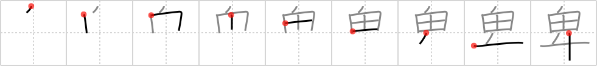

## {1511}

## `lowly`

## [9]

## Reading:

### On-Yomi: ヒ &mdash; Kun-Yomi: いや.しい、いや.しむ、いや.しめる

### Examples: 卑しい (いや.しい), 卑しむ (いや.しむ), 卑しめる (いや.しめる)

## Words:

卑しい(いやしい): greedy, vulgar, shabby, humble, base, mean, vile

卑怯(ひきょう): cowardice, meanness, unfairness
