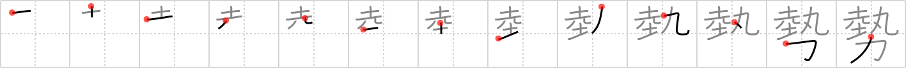

# {勢}

## `forces`

## Strokes: 13

## Reading:

### On-Yomi: セイ、ゼイ &mdash; Kun-Yomi: いきお.い、はずみ

### Examples: 勢い (いきお.い)

## Words:

形勢(けいせい): condition, situation, prospects

情勢(じょうせい): state of things, condition, situation

勢力(せいりょく): influence, power, might, strength, potency, force, energy

態勢(たいせい): attitude, conditions, preparations

優勢(ゆうせい): superiority, superior power, predominance, preponderance

勢い(いきおい): force, vigor, energy, spirit, life, authority, influence, power, might, tendency, necessarily

姿勢(しせい): attitude, posture

大勢(おおぜい): many, a great number (of people)
