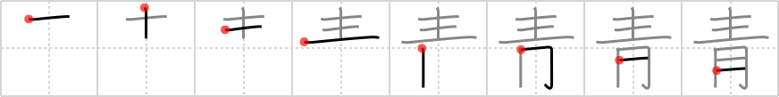

# {青}

## `blue`

## Strokes: 8

## Reading:

### On-Yomi: セイ、ショウ &mdash; Kun-Yomi: あお、あお-、あお.い

### Examples: 青天 (せいてん), 青銅 (せいどう), 青年 (せいねん), 青 (あお), 青い (あお.い)

## Words:

青白い(あおじろい): pale

青春(せいしゅん): youth, springtime of life, adolescent

青(あお): the color blue, the color green (noun), green light

青少年(せいしょうねん): youth, young person

青年(せいねん): youth, young man

真っ青(まっさお): deep blue, ghastly pale

青い(あおい): blue, pale, green, unripe, inexperienced
