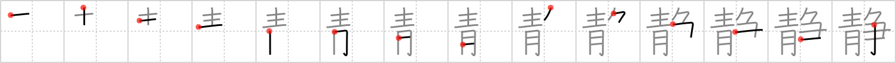

## `quiet`

## [14]

## Reading:

### On-Yomi: セイ、ジョウ &mdash; Kun-Yomi: しず-、しず.か、しず.まる、しず.める

## Heisig story:

<i>Blue</i> . . . <i>contend</i>. Do not confuse with <i>calm</i> (Frame 1230).

## Koohii stories:

1) [<a href="http://kanji.koohii.com/profile/rgravina">rgravina</a>] 16-8-2006(201): When someone you know who is normally talkative goes<strong> quiet</strong>, it&#039;s usually a sign that they are <em>contending</em> with the <em>blues</em>.

2) [<a href="http://kanji.koohii.com/profile/zz_alex_zz">zz_alex_zz</a>] 24-3-2008(75): &quot;And the next <em>contend</em>er is.... a <em>Smurf</em>!&quot; As you can imagine, the crowd goes <strong>quiet</strong> with shock.

3) [<a href="http://kanji.koohii.com/profile/Raichu">Raichu</a>] 31-8-2006(62): When you feel <em>blue</em>, you want to go somewhere<strong> quiet</strong> to help you <em>contend</em> with your problems.

4) [<a href="http://kanji.koohii.com/profile/robertmyers">robertmyers</a>] 17-12-2011(33): The once proud and boisterous contender has been smacked down by a smurf and is<strong> quiet</strong> for once.

5) [<a href="http://kanji.koohii.com/profile/Skinny">Skinny</a>] 16-6-2009(24): Best way to get kids to be<strong> quiet</strong>. Have a<strong> quiet</strong> contest. Each contender must be<strong> quiet</strong> by holding their breath until they turn blue in the face.

6) [<a href="http://kanji.koohii.com/profile/akrodha">akrodha</a>] 17-5-2007(9): On the night before a fight, the contenders stay in a hotel room with loud, red furniture to build up anger. But the night after the fight, the <em>contenders</em> stay in a room with<strong> quiet</strong>, <em>blue</em> furniture to relax.

7) [<a href="http://kanji.koohii.com/profile/Katsuo">Katsuo</a>] 21-1-2010(7): Tip: Primitive positions: Note how <em>blue</em> has<strong> quiet</strong>ly crept to the other side... it&#039;s normally on the right.

8) [<a href="http://kanji.koohii.com/profile/rtkrtk">rtkrtk</a>] 12-2-2008(7): Don&#039;t confuse with <a href="../240">silence</a> (#240 黙), something achieved through action. On the other hand,<strong> quiet</strong> refers to a personal quality of not speaking out. Members of <em>Blue</em>-man group jump into the wrestling ring of <em>contend</em>ers for tag-team wrestling. Though the other contenders are screaming, the <em>blue</em> men never say anything - they are a very<strong> quiet</strong> bunch, that Blue-man group. Primitive order: blue man group&#039;s first and main characteristic is being blue and<strong> quiet</strong>; only later did they decide to become wrestling contenders.

9) [<a href="http://kanji.koohii.com/profile/shirish">shirish</a>] 30-12-2008(6): Sit<strong> quiet</strong> and enjoy the <em>blue</em>, don&#039;t <em>contend</em> with it.

10) [<a href="http://kanji.koohii.com/profile/PepeSeco">PepeSeco</a>] 7-12-2005(6): &quot;All<strong> Quiet</strong> on the Western Front&quot;: it was<strong> quiet</strong> that day, the sky was <em>blue</em>, and the armies did not <em>contend</em>, but the soldier still got killed.
