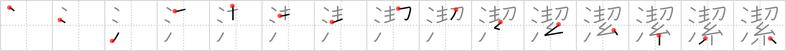

# {1548}

## `undefiled`

## [15]

## Reading:

### On-Yomi: ケツ &mdash; Kun-Yomi: いさぎよ.い

### Examples: 潔い (いさぎよ.い)

## Words:

簡潔(かんけつ): brevity, conciseness, simplicity

清潔(せいけつ): clean

不潔(ふけつ): unclean, dirty, filthy, impure
