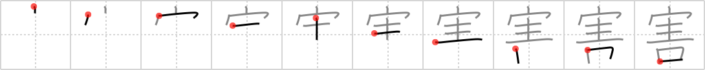

# {害}

## `harm`

## Strokes: 10

## Reading:

### On-Yomi: ガイ

## Words:

害する(がいする): to injure, to damage, to harm, to kill, to hinder

危害(きがい): injury, harm, danger

災害(さいがい): calamity, disaster, misfortune

迫害(はくがい): persecution

妨害(ぼうがい): disturbance, obstruction, hindrance, jamming, interference

害(がい): injury, harm, damage, evil influence

公害(こうがい): public nuisance, pollution

障害(しょうがい): obstacle, impediment (fault), damage

損害(そんがい): damage, injury, loss

被害(ひがい): damage

利害(りがい): advantages and disadvantages, interest
