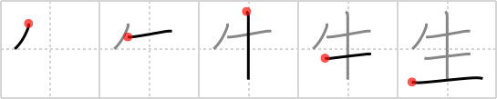

## `life`

## [5]

## Reading:

### On-Yomi: セイ、ショウ &mdash; Kun-Yomi: い.きる、い.かす、い.ける、う.まれる、う.まれ、うまれ、う.む、お.う、は.える、は.やす、き、なま、なま-、な.る、な.す、む.す、-う

### Examples: 生活 (せいかつ), 発生 (はっせい), 先生 (せんせい), 生かす (い.かす), 生きる (い.きる), 生ける (い.ける), 生まれる (う.まれる), 生む (う.む), 生う (お.う), 生 (き), 生 (なま), 生える (は.える), 生やす (は.やす)

## Words:

生かす(いかす): to revive, to resuscitate, to make use of

生まれつき(うまれつき): by nature, by birth, native

衛生(えいせい): health, hygiene, sanitation, medical

生(き): pure, undiluted, raw, crude

生真面目(きまじめ): too serious, person who is too serious, honesty, sincerity

再生(さいせい): playback, regeneration, resuscitation, return to life, rebirth, reincarnation, narrow escape, reclamation, regrowth

出生(しゅっしょう): birth

新入生(しんにゅうせい): freshman, first-year student

生育(せいいく): growth, development, breeding

生活(せいかつ): living, life (one´s daily existence), livelihood

生計(せいけい): livelihood, living

生死(せいし): life and death

生長(せいちょう): growth, increment

生理(せいり): physiology, menses

畜生(ちくしょう): beast, brute, damn

生臭い(なまぐさい): smelling of fish or blood, fish or meat

生温い(なまぬるい): lukewarm, halfhearted

生身(なまみ): living flesh, flesh and blood, the quick

年生(ねんせい): pupil in .... year, student in .... year

発生(はっせい): outbreak, spring forth, occurrence, incidence, origin

生やす(はやす): to grow, to cultivate, to wear beard

野生(やせい): wild

生き生き(いきいき): vividly, lively

生き物(いきもの): animal

生け花(いけばな): flower arrangement

一生(いっしょう): lifetime, all through life, generation, age, era, the whole world

生まれ(うまれ): birth, birth-place

生地(きじ): cloth, material, texture, one´s true character, unglazed pottery

芝生(しばふ): lawn

写生(しゃせい): sketch, drawing from nature, portrayal, description

小学生(しょうがくせい): grade school student

生じる(しょうじる): produce, yield, result from, arise, be generated

生ずる(しょうずる): cause, arise, be generated

人生(じんせい): (human) life (i.e. conception to death)

生産(せいさん): production, manufacture

生存(せいぞん): existence, being, survival

生年月日(せいねんがっぴ): birth date

生物(せいぶつ): living things, creature

生命(せいめい): life, existence

誕生(たんじょう): birth

生(なま): raw, unprocessed

生意気(なまいき): impertinent, saucy, cheeky, conceit, audacious, brazen

生る(なる): bear fruit

生える(はえる): grow, spring up

生きる(いきる): live, exist

一生懸命(いっしょうけんめい): as well as one can, as hard as one can

高校生(こうこうせい): high school student

大学生(だいがくせい): university student

生まれる(うまれる): be born

学生(がくせい): student

生徒(せいと): pupil

先生(せんせい): teacher, master, doctor

誕生日(たんじょうび): birthday

留学生(りゅうがくせい): overseas student

## Koohii stories:

1) [<a href="http://kanji.koohii.com/profile/TheSleeve">TheSleeve</a>] 5-11-2007(221): This is the first CELL of a human, the foundation of its entire<strong> LIFE</strong>, a small DROP that will GROW UP to form a complex organism. 

2) [<a href="http://kanji.koohii.com/profile/brian44">brian44</a>] 19-12-2007(29): Growing Up is just a Drop of our<strong> LIFE</strong>. 

3) [<a href="http://kanji.koohii.com/profile/scottamus">scottamus</a>] 26-6-2006(13): Frankenstein&#039;s monster given the spark of<strong> life</strong>. Let&#039;s call him Frank. From Mary Shelley&#039;s work along with Young Frankenstein and other references. 

4) [<a href="http://kanji.koohii.com/profile/dboyle">dboyle</a>] 13-2-2009(11): Add a <em>drop</em> of miracle <em>grow</em> and a plant really comes to<strong> life</strong>. 

5) [<a href="http://kanji.koohii.com/profile/koohiikun">koohiikun</a>] 26-8-2009(8): <strong>Life</strong> starts with a <em>drop</em> of sperm and then you <em>grow up</em>. 

6) [<a href="http://kanji.koohii.com/profile/mantixen">mantixen</a>] 9-7-2009(8): A <em>cow</em> spends its<strong> life</strong> on the <em>ground</em>. 

7) [<a href="http://kanji.koohii.com/profile/skribblets">skribblets</a>] 2-9-2010(7): It should be obvious to anyone that used this as peter pan that the &quot;drop&quot; is Tinkerbell sitting on Peter&#039;s shoulder. So I call this primitive Tinkerbell. Story: The drop on Peter Pan&#039;s shoulder is Tinkerbell. She&#039;s always so full of<strong> LIFE</strong>. 

8) [<a href="http://kanji.koohii.com/profile/TheSlakey">TheSlakey</a>] 28-12-2008(4): Superman, the man with a drop of<strong> life</strong> that will never go out. 

9) [<a href="http://kanji.koohii.com/profile/awaken">awaken</a>] 8-7-2012(3): A <em>drop</em> of semen will <em>grow up</em> to become a<strong> life</strong>. 

10) [<a href="http://kanji.koohii.com/profile/Altaira">Altaira</a>] 9-5-2012(3): <em>Drop</em> the &#039;tude, <em>grow up</em> and get a<strong> LIFE</strong>! 
