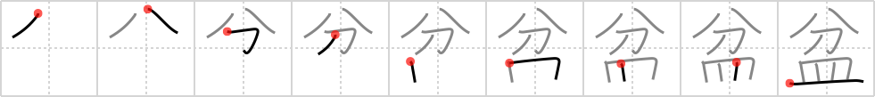

## `basin`

## [9]

## Reading:

### On-Yomi: ボン

## Heisig story:

Part . . . dish.

## Koohii stories:

1) [<a href="http://kanji.koohii.com/profile/rgravina">rgravina</a>] 17-6-2006(254): The <em>part</em> of the kitchen sink in which you wash <em>dishes</em> in is the<strong> basin</strong>.

2) [<a href="http://kanji.koohii.com/profile/crayonmaster">crayonmaster</a>] 5-4-2009(53): Your mom yells at you to stop throwing dishes in the<strong> basin</strong>. She lifts up (to show primitive order) the broken parts to show you the damage you&#039;ve done.

3) [<a href="http://kanji.koohii.com/profile/DrJones">DrJones</a>] 22-2-2008(18): If you break a coconut in two <em>parts</em>, you can improvise a kachi-kachi (a kind of castanet that is played at <strong>bon festivals</strong>). After the festival is done you can use them as a curved <em>dish</em>, a <strong>basin</strong> (synonym of bowl).

4) [<a href="http://kanji.koohii.com/profile/Immacolata">Immacolata</a>] 1-5-2006(15): When the god parted his soup dish in two it created a huge<strong> basin</strong>.

5) [<a href="http://kanji.koohii.com/profile/mairov">mairov</a>] 13-3-2008(14): It will take just a minute to wash the<strong> basin</strong>&#039;s dishes.

6) [<a href="http://kanji.koohii.com/profile/torida">torida</a>] 28-8-2010(8): I keep thinking I&#039;ve finished the washing up, but in under a <em>minute</em> the<strong> basin</strong>&#039;s full of <em>dishes</em> again... OR... It takes under a <em>minute</em> to do all the <em>dishes</em> in the<strong> basin</strong>.

7) [<a href="http://kanji.koohii.com/profile/gavin.schultz-ohkubo">gavin.schultz-ohkubo</a>] 11-6-2010(6): I&#039;m not an expert, but it seems that as a<strong> basin</strong> this refers more to an oceanic<strong> basin</strong> that a kitchen one, and in any case seems most common in reference to the famous O-Bon festival. So, a story: in the O-Bon festival, so many <em>dishes</em> are broken that all the <em>parts</em> have to be thrown into a deep oceanic<strong> basin</strong>.

8) [<a href="http://kanji.koohii.com/profile/Machine_Gun_Cat">Machine_Gun_Cat</a>] 11-3-2009(5): If you&#039;re really really uncoordinated then your<strong> Basin</strong> is full of <em>pieces</em> of broken <em>dishes</em>.

9) [<a href="http://kanji.koohii.com/profile/Boy.pockets">Boy.pockets</a>] 1-12-2010(4): The<strong> basin</strong> is the <em>part</em> of the kitchen where you wash the <em>dishes</em>.

10) [<a href="http://kanji.koohii.com/profile/tritonxg">tritonxg</a>] 12-5-2010(4): [FR]plats N1 <strong>BON </strong> kanji&amp;kana:1099<em> portion+assiette </em> <strong>O BON :</strong>pour la fête des morts on place des PORTIONS dans des ASSIETTES servant de <strong>PLAT</strong>S à offrandes 盆 【ぼん】Lantern Festival;tray 盆暗 【ぼんくら】stupidity;idiocy;blockhead;idiot;dimwit; mediocrity 盆栽 【ぼんさい】bonsai 海盆 【かいぼん】basin 盆景 【ぼんけい】 miniature garden.
