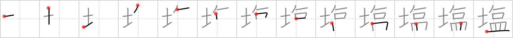

## `salt`

## [13]

## Reading:

### On-Yomi: エン &mdash; Kun-Yomi: しお

## Heisig story:

Ground . . . reclining . . . mouth . . . dish.

## Koohii stories:

1) [<a href="http://kanji.koohii.com/profile/bigloui">bigloui</a>] 29-3-2006(228): In the old days,<strong> salt</strong> was a worth alot, so it is not surprising to find someone <em>reclining</em> on the <em>ground</em>, <em>mouth</em> to <em>plate</em>, getting every last grain of that delicious<strong> salt</strong>.

2) [<a href="http://kanji.koohii.com/profile/Weber">Weber</a>] 21-2-2007(78): Remember the mock sushi documentary that circulated a while ago: &quot;Because some feel that the shoyu was not<strong> salt</strong>y enough, complementary<strong> salt</strong> dishes are provided on the ground outside the sushiya, you can recline and put as much as you desire in your mouth&quot;.

3) [<a href="http://kanji.koohii.com/profile/PepeSeco">PepeSeco</a>] 12-11-2006(53): It is bad luck to spill<strong> salt</strong> on the <em>ground</em>, so you better <em>recline</em> and lick it into your <em>mouth</em> or put it back on the <em>dish</em>.

4) [<a href="http://kanji.koohii.com/profile/joxn_costello">joxn_costello</a>] 12-1-2009(25): This is a picture of an artificial<strong> salt</strong> lick on the <em>grounds</em> of a nature preserve: animals can go there, <em>recline</em>, and use their <em>mouths</em> to lick the<strong> salt</strong> from a <em>dish</em>.

5) [<a href="http://kanji.koohii.com/profile/Transtic">Transtic</a>] 21-8-2010(10): In a<strong> SALT</strong> pan, all the <strong>soil</strong> is actually<strong> SALT</strong>. You can <strong>recline</strong>, taste it with your <strong>mouth</strong>, and put it in your <strong>dish</strong>. <a href="http://upload.wikimedia.org/wikipedia/commons/thumb/6/68/Salar_Uyuni_Bolivie.JPG/300px-Salar_Uyuni_Bolivie.JPG">http://upload.wikimedia.org/wikipedia/commons/thumb/6/68/Salar_Uyuni_Bolivie.JPG/300px-Salar_Uyuni_Bolivie.JPG</a> <a href="http://en.wikipedia.org/wiki/Salt_pan_%28geology%29">http://en.wikipedia.org/wiki/Salt_pan_%28geology%29</a>.

6) [<a href="http://kanji.koohii.com/profile/Schwingy">Schwingy</a>] 29-5-2009(9): At the Last Supper, a disciple spills the<strong> Salt</strong>... all of it...over the soil/dirt. &quot;Sweet Jesus, I spilled the<strong> salt</strong>! Bad luck!&quot; Jesus says, &quot;Did you use my name in vain? <em>Recline </em> back in your chair and open your <em>mouth</em>!&quot; The disciple does as he is told. Jesus pours a <em>Holy Grail</em> cup full of<strong> salt</strong> into his mouth...

7) [<a href="http://kanji.koohii.com/profile/Artur83">Artur83</a>] 11-9-2009(7): (<strong>German</strong>) Früher war Salz kostbar. Bergarbeiter mussten dafür unter die <em>Erde</em>, sich <em>zurückgelehnt</em> durch niedrige Schacht<em>öffnungen</em> quetschen und der Tagesertrag war oft nicht mehr als eine <em>Schale</em> voller <strong>Salz</strong>.

8) [<a href="http://kanji.koohii.com/profile/terozen">terozen</a>] 25-3-2012(6): In the old days, <strong>salt</strong> was worth alot, so it was not surprising to find someone on the <em>ground</em>, <em>lying down</em> with their <em>mouth</em> on the <em>dish</em>, licking up every last grain of that delicious <strong>salt</strong>.

9) [<a href="http://kanji.koohii.com/profile/Meconium">Meconium</a>] 21-1-2010(6): I&#039;m wandering around in a dry<strong> salt</strong> pan in the middle of the desert, delirious from dehydration and the hot sun. I&#039;m <em>lying down</em>, prone on the <em>ground</em>, imagining a delicious <em>dish</em> of food in my <em>mouth</em>. I open up, stick out my tongue, and end up with a <em>mouth</em>ful of<strong> salt</strong>!

10) [<a href="http://kanji.koohii.com/profile/Nukemarine">Nukemarine</a>] 1-3-2008(5): <strong>SALT</strong> of the earth (SOIL)? You think he&#039;s that? He just RECLINES back while stuffing his MOUTH with food from the PLATE.<strong> SALT</strong> he&#039;s definitely not.

### {V4: 1458, V6: 1568}
