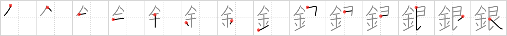

## `silver`

## [14]

## Reading:

### On-Yomi: ギン &mdash; Kun-Yomi: しろがね

## Heisig story:

Metal . . . silver.

## Premitive:

silver We give this element the meaning of silver from the kanji in the following FRAME. Both the original pictographic representation and the primitive elements that make it up are more trouble to hunt out than they are worth. It is best simply to learn it as is. In doing so, take careful note of the stroke order, and also the fact that when this element appears on the left, the penultimate stroke is omitted, giving us simply ・. [6]

## Koohii stories:

1) [<a href="http://kanji.koohii.com/profile/Pauline">Pauline</a>] 3-7-2007(165): Like <em>gold</em>, <em>silver</em> is a <em>metal</em>.

2) [<a href="http://kanji.koohii.com/profile/mhheie">mhheie</a>] 23-1-2008(52): Not sure why Heisig find the right side so troublesome. My grandma&#039;s <em>hairpin</em> (just before <a href="../v4/1920">long</a> (#1920 長)) is made of<strong> silver</strong>, the metal that best reflects <em>sun</em> light. I&#039;m sure you can see the flash from her hair as she walks by on a sunny day. Note that the two elements (<em>sun</em> and <em>hairpin</em>) share not only a horizontal stroke, but also the left vertical one. Therefore a bit odd stroke order.

3) [<a href="http://kanji.koohii.com/profile/theasianpleaser">theasianpleaser</a>] 21-1-2009(26): <em>Metal</em> that is<strong> silver</strong> is<strong> silver</strong>!

4) [<a href="http://kanji.koohii.com/profile/Harrow">Harrow</a>] 28-2-2009(20): <strong>Silver</strong> is almost as <a href="../v4/1468">good</a> (#1468 良) as gold, but not quite (one stroke missing).

5) [<a href="http://kanji.koohii.com/profile/Nijuro">Nijuro</a>] 21-7-2010(10): In order of value, it goes: <em>gold</em>, then <em><strong>silver</strong></em>.

6) [<a href="http://kanji.koohii.com/profile/Virtua_Leaf">Virtua_Leaf</a>] 21-9-2009(9): Ugh, I always think of just the primitive<strong> silver</strong> when it comes to this kanji.<strong> Silver</strong>; the only metal second to <em>gold</em>.

7) [<a href="http://kanji.koohii.com/profile/saizen">saizen</a>] 28-9-2008(9): Compared to <em>gold</em>,<strong> silver</strong> always comes second. (For placement).

8) [<a href="http://kanji.koohii.com/profile/Filip">Filip</a>] 7-2-2008(7): (Silver Sufer will be<strong> silver</strong>, and good will be quicksilver who turned good but can only do a drop of what<strong> Silver</strong> Surfer can)<strong> Silver</strong> Surfer is metal in case you are wondering...jeesh... and yes the metal board is maid of<strong> silver</strong> too. No you can&#039;t sell him.

9) [<a href="http://kanji.koohii.com/profile/nest0r">nest0r</a>] 31-1-2008(5): For<strong> silver</strong>, I just imagine a <em>sun</em> personification wearing a<strong> silver</strong> <em>scarf</em>. Of course,<strong> silver</strong> is a <em>metal</em>.

10) [<a href="http://kanji.koohii.com/profile/elhombrekanji">elhombrekanji</a>] 4-1-2010(3): Todavía hay gente que no sabe que la PLATA no es un metal.

### {V4: 1459, V6: 1569}
