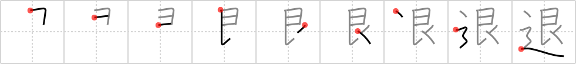

## `retreat`

## [9]

## Reading:

### On-Yomi: タイ &mdash; Kun-Yomi: しりぞ.く、しりぞ.ける、ひ.く、の.く、の.ける、ど.く

## Heisig story:

Road . . . silver.

## Koohii stories:

1) [<a href="http://kanji.koohii.com/profile/DurablePants">DurablePants</a>] 23-6-2006(217): You see a huge army of people in silver armour on the road so you<strong> retreat</strong>.

2) [<a href="http://kanji.koohii.com/profile/nolusu">nolusu</a>] 25-8-2007(72): In the land of Oz, you advance by following the golden road, but you reatreat by following the <em>Silver Road</em>.

3) [<a href="http://kanji.koohii.com/profile/PepeSeco">PepeSeco</a>] 25-6-2006(48): In Spanish there is a saying which is useful to remember this kanji. It says: &quot;A enemigo que huye, puente de plata,&quot; which translates literally as &quot;To enemy that<strong> retreat</strong>s, silver bridge,&quot; meaning one should not stay in the way of a<strong> retreat</strong>ing enemy. In the kanji we just replace the silver bridge by a <em>silver</em> <em>road</em>.

4) [<a href="http://kanji.koohii.com/profile/misha">misha</a>] 1-11-2007(41): Vampires<strong> retreat</strong> down the <em>road</em> when they see villagers arming themselves with <em>silverware</em>.

5) [<a href="http://kanji.koohii.com/profile/CharleyGarrett">CharleyGarrett</a>] 21-12-2006(13): Orders in from HQ: <em>Retreat</em>! Grab the <strong>silver</strong> and hit the <strong>road</strong>.

6) [<a href="http://kanji.koohii.com/profile/bihzad">bihzad</a>] 9-4-2008(10): The silver army was going to war, but they met the golden army on the road and decided to<strong> retreat</strong>.

7) [<a href="http://kanji.koohii.com/profile/Filip">Filip</a>] 7-2-2008(10): The Silver Surfer is<strong> retreat</strong>ing. See him running patheticly on the road, his silver skin all dented, his surfboard broken.

8) [<a href="http://kanji.koohii.com/profile/Dustin_Calgary">Dustin_Calgary</a>] 10-1-2009(9): <strong>RETREAT</strong>!!!<strong> RETREAT</strong>!!!, the great SILVER knight is out there on the ROAD!!

9) [<a href="http://kanji.koohii.com/profile/terozen">terozen</a>] 25-3-2012(7): <strong>Retreat</strong>! Grab the <em>silver</em>, hit the <em>road</em> and <strong>retreat</strong>!

10) [<a href="http://kanji.koohii.com/profile/tritonxg">tritonxg</a>] 21-7-2010(5): [FR]retraite japlt:N2 <strong>TAI shirizo(ku/keru) </strong> k&amp;k:846 <em> argent+chemin</em> Quand on prend sa <strong>RETRAITE</strong> on reçoit une pension comme ARGENT après avoir accompli un CHEMIN de 40 annuités 退位 【たいい】abdication 退院 【たいいん】leaving hospital 退官 【たいかん】retirement from office 退社 【たいしゃ】leaving office 海退 【かいたい】regression 廃退 【はいたい】decadence 部隊撤退 【ぶたいてったい】troop withdrawal 退学 【たいがく】dropping out of school.

### {V4: 1465, V6: 1575}
