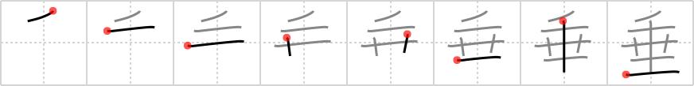

## `droop`

## [8]

## Reading:

### On-Yomi: スイ &mdash; Kun-Yomi: た.れる、た.らす、た.れ、-た.れ、なんなんと.す

## Heisig story:

<i>A drop of</i> . . . <i>silage</i> . . . <i>walking stick</i> . . . <i>floor</i>. The character is written in the order of its elements.

## Koohii stories:

1) [<a href="http://kanji.koohii.com/profile/rgravina">rgravina</a>] 16-8-2006(158): For an old man with a <em>walking stick</em>, even a <em>drop</em> of <em>silage</em> to carry on his back will make him <em>droop</em> low down to the <em>floor</em>.

2) [<a href="http://kanji.koohii.com/profile/SammyB">SammyB</a>] 13-9-2008(107): Even a <em>drop</em> of <em>silage</em> is enough to make an old man with a <em>walking stick</em><strong> droop</strong> low down to the <em>floor</em>. (rgravina - fixed up order).

3) [<a href="http://kanji.koohii.com/profile/sgrant">sgrant</a>] 21-12-2008(41): Imagine looking through the sight of a hitman&#039;s <em>crosshair</em>. The bullet hits, a <em>drop of</em> blood appears on the target&#039;s shirt. The target drops his <em>walking stick</em> and starts to<strong> droop</strong>... finally hitting the <em>floor</em>. (I take &#039;<em>silage</em>&#039; to mean &#039;<em>crosshair</em>&#039;).

4) [<a href="http://kanji.koohii.com/profile/dingomick">dingomick</a>] 6-9-2007(39): Image: a poor shriveled old lady struggling with a &quot;droop&quot;ing load of <em>silage</em> on her shoulders. A <em>bit</em> falls to the <em>ground</em> and she <em>droop</em>s a little further to pick it up.

5) [<a href="http://kanji.koohii.com/profile/fuaburisu">fuaburisu</a>] 25-10-2005(16): Hint : as a primitive, I used the image of <em>Droopy</em> Dog, the cartoon character created by Tex Avery.

6) [<a href="http://kanji.koohii.com/profile/jmcanally">jmcanally</a>] 31-1-2010(10): The <em>porter</em><strong> droop</strong>ed under the heavy load of <em>silage</em> placed on his back.

7) [<a href="http://kanji.koohii.com/profile/ruuku35">ruuku35</a>] 7-8-2007(8): A THOUSAND FLOWERS<strong> DROOP</strong> on the SOIL.

8) [<a href="http://kanji.koohii.com/profile/mickymay">mickymay</a>] 25-4-2012(5): Silage was to hard but this one works for me: This Kanji is a symbol for the saying &quot;the last straw that broke the camels back&quot;. The drop one top is the last straw. The center part, which Heisig calls the silage radical, is a very simplified pack animal like a camel or donkey. The vertical line literally means to &quot;vertically<strong> droop</strong>&quot; down, which is what the Kanji actually means. And the line on the ground finishes the story of the poor camel by saying it dropped down on the floor.

9) [<a href="http://kanji.koohii.com/profile/Yuta73">Yuta73</a>] 2-12-2012(3): Easy: A <em>drop</em> of the <em>silage</em> <strong>droop</strong>s to the <em>floor</em>.

10) [<a href="http://kanji.koohii.com/profile/phantombk201">phantombk201</a>] 14-9-2010(3): I use sniper&#039;s crosshair instead of silage.see <a href="../1581">splendor</a> (#1581 華).a sniper was aiming at an old man with a walking stick,the man dropped his walking stick on the floor so he<strong> droop</strong>ed to get it,at the exact same time the sniper shot his bullet so it missed the old man by just a tiny drop!
