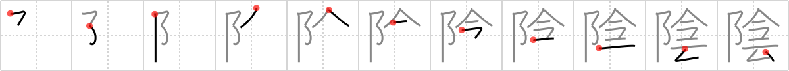

## `shade`

## [11]

## Reading:

### On-Yomi: イン &mdash; Kun-Yomi: かげ、かげ.る

## Heisig V6:

Just as the <i>sunshine</i> (Frame 1397) represents the masculine principle in nature (Yang), the <b>shade</b> stands for the feminine principle (Yin). Its elements are: <i>pinnacle</i> . . . <i>clock</i> . . . <i>rising cloud</i>.

## Koohii stories:

1) [<a href="http://kanji.koohii.com/profile/dingomick">dingomick</a>] 6-3-2007(238): The only <strong>shade</strong> at <em>The Pinnacle</em> is in the shadow of the giant <em>clock</em> tower, or from a <em>rising cloud</em>.

2) [<a href="http://kanji.koohii.com/profile/sutebun">sutebun</a>] 26-2-2008(40): Frosty the snowman is running around the pinnacle, staying in the<strong> shade</strong>. As he looks at his clock to see how much longer he can last, small clouds rise (steam) from his body. Nooo, Frosty!

3) [<a href="http://kanji.koohii.com/profile/CountPacula">CountPacula</a>] 31-7-2008(33): The <em>pinnacle</em> is in the<strong> shade</strong>, because it has <em>now</em> become <em>cloudy</em>.

4) [<a href="http://kanji.koohii.com/profile/findus">findus</a>] 4-6-2009(24): To avoid the confusion with <a href="../1712">shadow</a> (#1712 影), let&#039;s use a rhyme : At <em>The Pinnacle</em>, the only <strong>shade</strong> / is that of thinks that are man-made (The giant <em>clock</em> tower, and the <em>rising cloud</em> from a factory).

5) [<a href="http://kanji.koohii.com/profile/sulris">sulris</a>] 10-3-2011(18): You are now 75% of the way through the 2136 joyo kanji!

6) [<a href="http://kanji.koohii.com/profile/CharleyGarrett">CharleyGarrett</a>] 30-1-2007(10): You lookin&#039; for <strong>shade</strong>? You&#039;re at the <em>pinnacle</em>! <em>Now</em>, only a <em>rising cloud</em> can give you <strong>shade</strong>. nmkohi 22-7-2006.

7) [<a href="http://kanji.koohii.com/profile/bihzad">bihzad</a>] 18-4-2008(8): The Pinnacle has a sinister clock-tower that may be tuned to 7, at which time, a rising cloud<strong> shade</strong>s the Pinnacle in an impenetrable shadow, hiding it from view.

8) [<a href="http://kanji.koohii.com/profile/Korvar">Korvar</a>] 20-10-2010(7): The only<strong> shade</strong> at The Pinnacle is in the shadow of the giant clock tower, that rises above the clouds. (adapted from dingomick).

9) [<a href="http://kanji.koohii.com/profile/manubear">manubear</a>] 5-5-2012(5): In ancient times, at the <em>Acropolis</em> they used to tell the time by using a sun dial (<em>clock</em>) and the sun&#039;s<strong> shade</strong>. The<strong> shade</strong> it created was so big people could sit under it! Of course there were problems when there were too many <em>rising clouds</em> about... ( 陰茎 , 日陰 , 陰陽 ).

10) [<a href="http://kanji.koohii.com/profile/Srdjan">Srdjan</a>] 1-9-2010(5): Dingomick edit: The only <strong>shade</strong> at <em>The Pinnacle</em> is in the shadow of the giant <em>clock</em> tower, which raises above the clouds.
