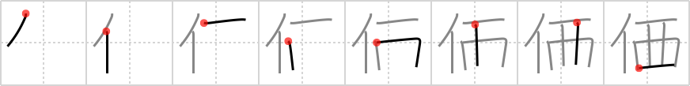

## {1603}

## `value`

## [8]

## Reading:

### On-Yomi: カ、ケ &mdash; Kun-Yomi: あたい

### Examples: 価 (あたい)

## Words:

価格(かかく): price, value, cost

価値(かち): value, worth, merit

高価(こうか): high price

定価(ていか): established price

評価(ひょうか): valuation, estimation, assessment, evaluation

物価(ぶっか): prices of commodities, prices (in general), cost-of-living
