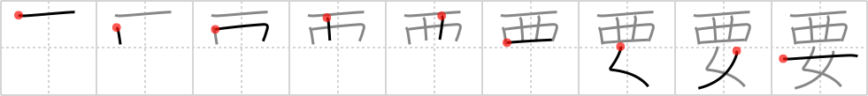

## `need`

## [9]

## Reading:

### On-Yomi: ヨウ &mdash; Kun-Yomi: い.る

### Examples: 要る (い.る)

## Words:

要因(よういん): primary factor, main cause

要する(ようする): to demand, to require, to take

要請(ようせい): claim, demand, request, application

要望(ようぼう): demand for, request

重要(じゅうよう): important, momentous, essential, principal, major

主要(しゅよう): chief, main, principal, major

需要(じゅよう): demand, request

要求(ようきゅう): request, demand, requisition

要旨(ようし): gist, essentials, summary, fundamentals

要するに(ようするに): in a word, after all, the point is ..., in short ...

要素(ようそ): element

要点(ようてん): gist, main point

要領(ようりょう): point, gist, essentials, outline

必要(ひつよう): necessary

要る(いる): need

## Koohii stories:

1) [<a href="http://kanji.koohii.com/profile/takoman">takoman</a>] 9-6-2008(106): (ヨウ) When Clint<strong> need</strong>s a woman, he likes to be on top. 

2) [<a href="http://kanji.koohii.com/profile/mantixen">mantixen</a>] 27-9-2008(99): In the <em>Old West</em>, <em>women</em> were<strong> need</strong>ed because nobody knew how to cook or clean. 

3) [<a href="http://kanji.koohii.com/profile/fuaburisu">fuaburisu</a>] 25-10-2005(50): In some movie with the theme of the <em>Old West</em>, the population of a town finds themselve in dire<strong> need</strong> of <em>women</em>, after all of the town&#039;s <em>womens</em> became crazy and started gunshooting and participating in duels and such. 

4) [<a href="http://kanji.koohii.com/profile/dingomick">dingomick</a>] 9-4-2007(42): <em>Old West</em>ern drunkard in a saloon in a town of men (cowboys, gold panners, blacksmiths, etc), &quot;I <strong>need</strong> me a <em>woman</em>! Get over here, boy, you&#039;ll have to do.&quot;. 

5) [<a href="http://kanji.koohii.com/profile/chameleoncoder">chameleoncoder</a>] 27-11-2009(24): In the <em>old west</em> the<strong> need</strong>s of a <em>woman</em> were always at the bottom. 

6) [<a href="http://kanji.koohii.com/profile/Soseki">Soseki</a>] 19-3-2008(18): When Richard Nixon met Chairman Mao he quipped that <em>western</em> countries were in<strong> need</strong> of <em>women</em> to boost their populations. Mao actually suggested sending a million Chinese <em>women</em> to the United States. True Story. 

7) [<a href="http://kanji.koohii.com/profile/samuize">samuize</a>] 1-4-2008(16): Western women have many material<strong> need</strong>s. 

8) [<a href="http://kanji.koohii.com/profile/nesert">nesert</a>] 3-7-2010(13): The <em>Old West</em><strong> need</strong>ed -- really, really<strong> need</strong>ed- more <em>women</em>. 

9) [<a href="http://kanji.koohii.com/profile/icamonkey">icamonkey</a>] 22-12-2008(11): My mom always tells me, &quot;you<strong> need</strong> a nice <em>Western woman</em>.&quot; Even though I like &#039;em from the East. 

10) [<a href="http://kanji.koohii.com/profile/Virtua_Leaf">Virtua_Leaf</a>] 13-1-2008(7): We<strong> need</strong> <em>women</em>! If we don&#039;t get some soon this place&#039;ll turn into a ghost town! 
