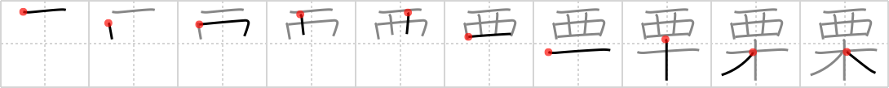

## `chestnut`

## [10]

## Reading:

### On-Yomi: リツ、リ &mdash; Kun-Yomi: くり、おののく

## Koohii stories:

1) [<a href="http://kanji.koohii.com/profile/inuki">inuki</a>] 9-11-2006(356): <strong>Chestnut</strong> tree, west nut tree. 

2) [<a href="http://kanji.koohii.com/profile/Filip">Filip</a>] 23-2-2008(29): The cowboy climbed the tree to see where they were in the woods. The poor guy chose a <strong>chestnut</strong> tree. ouch ouch. 

3) [<a href="http://kanji.koohii.com/profile/fergal">fergal</a>] 7-11-2009(26): Picture an <em>old western</em> cowboy on his front porch shooting <strong>chestnuts</strong> off his <strong>chestnut</strong> <em>tree</em>. 

4) [<a href="http://kanji.koohii.com/profile/Koos83">Koos83</a>] 10-1-2010(13): One of the <em>trees</em> most common in the <em>Old West</em> was the<strong> chestnut</strong>. Not the <a href="../514">horse chestnut</a> (#514 <a href="http://jisho.org/kanji/details/栃">栃</a>). They tried that first, but the horses spent all day eating those and they could never ride them. 

5) [<a href="http://kanji.koohii.com/profile/CharleyGarrett">CharleyGarrett</a>] 13-10-2006(11): Due to the great <strong>chestnut</strong> blight, since the time of the <em>old west</em> you just cannot find any more of these <em>trees</em>. 

6) [<a href="http://kanji.koohii.com/profile/Beneus">Beneus</a>] 23-1-2009(8): There were a lot of casualties in the <em>old west</em>, as cowboys would get hit by falling<strong> chestnut</strong>s when riding under the <em>trees</em>. Thinking they were under attack, the jittery cowboys would do a quick-draw and shoot the first person they saw. it was a dangerous era indeed. 

7) [<a href="http://kanji.koohii.com/profile/gfb345">gfb345</a>] 24-4-2010(6): <strong>[100% FAKE ETYMOLOGY]</strong> The expression &quot;old <strong>CHESTNUT</strong>&quot;, meaning a tired, too-often-told story or cliché, comes from a staple of <em>old WESTERN</em>s: whenever there was a need to hang someone, the posse invariably picked &quot;that ol&#039;<strong> CHESTNUT</strong> <em>TREE</em>&quot; right outside of town. Hence, &quot;old <strong>CHESTNUT</strong>&quot; became synonymous with a tired, worn-out cliché. (<a href="http://snipurl.com/chestnut">http://snipurl.com/chestnut</a>) <strong>[100% FAKE ETYMOLOGY]</strong>. 

8) [<a href="http://kanji.koohii.com/profile/efeilliaid">efeilliaid</a>] 9-11-2009(4): <strong>Chestnut</strong>s on a<strong> CHESTNUT</strong> tree resemble western style cowboy spurs. <a href="<a href="http://en.wikipedia.org/wiki/File">http://en.wikipedia.org/wiki/File</a>"><a href="http://en.wikipedia.org/wiki/File">http://en.wikipedia.org/wiki/File</a></a>:Spurs_cowboy_crockett.jpg <a href="<a href="http://en.wikipedia.org/wiki/File">http://en.wikipedia.org/wiki/File</a>"><a href="http://en.wikipedia.org/wiki/File">http://en.wikipedia.org/wiki/File</a></a>:Ch%C3%A2taignier_120807_1.jpg. 

9) [<a href="http://kanji.koohii.com/profile/yLaguardia">yLaguardia</a>] 24-6-2012(3): Chwestnut tree. 

10) [<a href="http://kanji.koohii.com/profile/jameserb">jameserb</a>] 4-7-2008(3): In the old west, there were a lot of<strong> chestnut</strong> trees. They were wiped out in the 20th century by a blight. 
