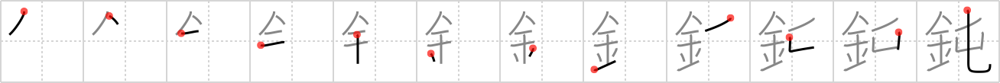

## `dull`

## [12]

## Reading:

### On-Yomi: ドン &mdash; Kun-Yomi: にぶ.い、にぶ.る、にぶ-、なま.る、なまく.ら

## Heisig story:

Metal . . . earthworm.

## Koohii stories:

1) [<a href="http://kanji.koohii.com/profile/gibosi">gibosi</a>] 2-5-2007(193): The metal hook is too<strong> dull</strong> to even pierce an earthworm....

2) [<a href="http://kanji.koohii.com/profile/Neobeo">Neobeo</a>] 21-12-2008(52): I was excited when they made a game that was a combination of <em>Metal</em> Gear and <em>Earthworm</em> Jim. But it turned out to be pretty<strong> dull</strong>.

3) [<a href="http://kanji.koohii.com/profile/erikkusan">erikkusan</a>] 12-3-2006(45): From the earthworm&#039;s perspective, it most be pretty<strong> dull</strong> when you are put in a metal bowl, just waiting for being put on the hook on the fishing trip the next day.

4) [<a href="http://kanji.koohii.com/profile/romanrozhok">romanrozhok</a>] 30-1-2008(29): Can mean both a<strong> dull</strong> object and a<strong> dull</strong> person. STORY: If the tip if your GOLD/METAL knife looks like the tip of an EARTHWORM, it is a<strong> DULL</strong> knife.

5) [<a href="http://kanji.koohii.com/profile/blaked569">blaked569</a>] 12-6-2009(19): There are two kinds of<strong> dull</strong>. One is like <em>metals</em> without lustre. The other is like how an <em>earthworm</em> is really boring. Two different kinds of<strong> dull</strong>.

6) [<a href="http://kanji.koohii.com/profile/Immacolata">Immacolata</a>] 5-3-2006(11): Earthworm Jims metal suit has gotten<strong> dull</strong> after a long stay below the earth&#039;s crust.

7) [<a href="http://kanji.koohii.com/profile/stehr">stehr</a>] 20-10-2007(8): <em>earthworm</em> crawls along the edge of a piece of <em>metal</em> that he didn&#039;t know was a razor; lucky for him it was<strong> dull</strong>.

8) [<a href="http://kanji.koohii.com/profile/dtachd">dtachd</a>] 23-2-2010(6): Even if <em>earthworms</em> were <em>gold</em>, they&#039;d still be<strong> dull</strong>.

9) [<a href="http://kanji.koohii.com/profile/CharleyGarrett">CharleyGarrett</a>] 19-2-2007(6): Well, naturally, a <em>metal</em> suit is gonna get a little <strong>dull</strong>. Whenever <em>Earthworm Jim</em> does a long stay below the earth&#039;s crust, there&#039;s some polishing to be done.

10) [<a href="http://kanji.koohii.com/profile/uberclimber">uberclimber</a>] 15-3-2011(3): The <em>metal</em> bulkhead of the <em>barracks</em> was so<strong> dull</strong> that the drill sergeant made us polish it up. It was very<strong> dull</strong> work. 鈍い (にぶい) :<strong> dull</strong> (e.g. a knife), thickheaded, slow, stupid; 鈍い (のろい) :<strong> dull</strong> (e.g. a knife), thickheaded, slow, stupid; 鈍る (なまる) : to become less capable, to grow<strong> dull</strong>, to become blunt, to weaken; 鈍感 (どんかん) : thickheadedness, stolidity.
