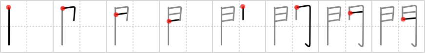

## `gates`

## [8]

## Reading:

### On-Yomi: モン &mdash; Kun-Yomi: かど、と

## Heisig V6:

The pictograph of two swinging <b>gates</b> is so clear in this kanji that only its stroke order needs to be memorized. In case you should have any trouble, though, you might doodle with the shapes on a piece of paper, taking care to note the difference in the stroke order of the two facing doors. The <b>gates</b> usually serve as an enclosure, and are written BEFORE whatever it is they enclose.

## Koohii stories:

1) [<a href="http://kanji.koohii.com/profile/dukelexon">dukelexon</a>] 16-1-2008(175): Heisig&#039;s stroke order in the 4th edition (and earlier) is wrong, so be careful -- first is the left-most vertical stroke, then draw the rest of the &quot;sun&quot; attachment as you would normally. In fact, if you just wrote it out as two suns with elongated sides, you&#039;ll get the stroke order exactly correct.

2) [<a href="http://kanji.koohii.com/profile/scottamus">scottamus</a>] 4-9-2006(56): The<strong> gates</strong> to Hell. guarded by Cerebus or ... Bill<strong> Gates</strong>?

3) [<a href="http://kanji.koohii.com/profile/KristinHolly">KristinHolly</a>] 25-11-2008(23): Bill<strong> Gates</strong> is just about to walk into a saloon.

4) [<a href="http://kanji.koohii.com/profile/Howdoken">Howdoken</a>] 11-5-2008(18): The<strong> GATES</strong> of Hell make a great primitive for the following frames.

5) [<a href="http://kanji.koohii.com/profile/Dustin_Calgary">Dustin_Calgary</a>] 14-1-2009(9): Primitives, Either<strong> gates</strong> to hell, or the pearly<strong> gates</strong> :D.

6) [<a href="http://kanji.koohii.com/profile/erikkusan">erikkusan</a>] 17-3-2006(7): I&#039;ll use Bill<strong> Gates</strong>.

7) [<a href="http://kanji.koohii.com/profile/shuusaku">shuusaku</a>] 3-3-2010(6): Bill<strong> GATES</strong> and his typical glasses.

8) [<a href="http://kanji.koohii.com/profile/mantixen">mantixen</a>] 27-9-2008(5): One leg of each <em>lesbian companion</em> is hidden as they rub their<strong> gates</strong> together.

9) [<a href="http://kanji.koohii.com/profile/rgravina">rgravina</a>] 20-8-2006(4): I&#039;ll use Bill<strong> Gates</strong> too!

10) [<a href="http://kanji.koohii.com/profile/kapalama">kapalama</a>] 13-9-2011(2): 専門学 , 羅生門 , 門下生 , <a href="../1616">gates</a> (#1616 門) モン, かど ... Pictograph (cf: 問題 <a href="../1617">question</a> (#1617 問), etc.) ... Note: Primitive Nicknames: <strong>Bill<strong> Gates</strong></strong>, <strong>Lesbians</strong>, <strong>Drawbridge</strong>, <strong>Gates of Hell</strong>, <strong>Fushimi Inari</strong> (<a href="http://bit.ly/apAOcz">http://bit.ly/apAOcz</a>), <strong>Christo</strong>.
