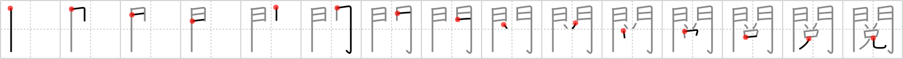

## `review`

## [15]

## Reading:

### On-Yomi: エツ &mdash; Kun-Yomi: けみ.する

## Heisig story:

<i>Gates</i> . . . <i>devil</i>. Keep the connotation of this key word distinct from those of <i>inspection</i> (Frame 1174), <i>revise</i> (Frame 362), and <i>perusal</i> (Frame 919).

## Koohii stories:

1) [<a href="http://kanji.koohii.com/profile/dwhitman">dwhitman</a>] 16-1-2008(261): A little <em>devil</em> at the <em>gates of hell</em><strong> review</strong>s your record to see if you&#039;re evil enough to get in.

2) [<a href="http://kanji.koohii.com/profile/akrodha">akrodha</a>] 22-5-2007(37): As I was <strong>reviewing</strong> for my exam at a quiet saloon, the <em>devil</em> popped out of nowhere and offered to make sure I pass. But I told him no way, since that&#039;s cheating. Besides, I&#039;m just <strong>reviewing</strong> things I already know. I won&#039;t fail. But he kept insisting, so I kicked him and sent him crashing through the entrance <em>gates</em>.

3) [<a href="http://kanji.koohii.com/profile/rgravina">rgravina</a>] 20-8-2006(30): <em>Gates&#039;</em> IS the <em>devil</em>. He releases software that clearly hasn&#039;t gone through any kind of <em>review</em> process.

4) [<a href="http://kanji.koohii.com/profile/furrykef">furrykef</a>] 29-6-2008(22): At the <em>gates</em> of Hell, the <em>Devil</em> greets you with his punishment: to<strong> review</strong> kanji flash cards for the rest of your life! (Not that I think anything is wrong with Heisig, but it does get tiring and I certainly wouldn&#039;t want to do it all my life. ;)).

5) [<a href="http://kanji.koohii.com/profile/decals">decals</a>] 2-2-2009(13): At the Gates of Hell: &quot;What did I do to get here?&quot; you ask in disbelief. &quot;Well, let&#039;s<strong> review</strong>...&quot; says Satan.

6) [<a href="http://kanji.koohii.com/profile/sicofante">sicofante</a>] 30-1-2009(13): If you add 3007 kanji flashcards in one day on this site and then start to<strong> review</strong> them, then you are about to open the <em>gates</em> of <em>devil</em>...(=tons of expired cards to<strong> review</strong> in the next days!).

7) [<a href="http://kanji.koohii.com/profile/Meconium">Meconium</a>] 18-5-2009(8): The <em>horny teenager</em> is sitting at the <em>gates of Hell</em>,<strong> review</strong>ing the Kanji. He comes up with a truly grotesque story and shares it on this site - the number of reports were so high that the <em>gates</em> opened and he was confined to the infernal depths for eternity.

8) [<a href="http://kanji.koohii.com/profile/cbogart">cbogart</a>] 22-2-2007(6): Standing at the gates of Hell, Satan<strong> review</strong>s his troops before they march forth to bring on the apocalypse.

9) [<a href="http://kanji.koohii.com/profile/lvk01">lvk01</a>] 27-3-2012(4): I used dwhitman&#039;s story, except you get a long list of Heisig kanji<strong> review</strong>s at the gates of Hell. If you get all of them right, you can leave again, so study diligently! (I had an easier time remembering &#039;review&#039; in the context of &#039;kanji<strong> review</strong>s&#039; myself, given as you also have revise (frame 339) &#039;interview&#039; in another 300 frames or so.).

10) [<a href="http://kanji.koohii.com/profile/usis35">usis35</a>] 20-12-2009(4): Bill GATES , the typical HORNY TEENAGER , has to seriously<strong> REVIEW</strong> his WEB BROWSER IE8 because it&#039;s losing popularity against Firefox and Chrome... 閲覧 【えつらん】 browser.
