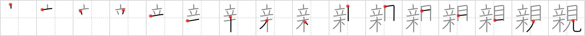

## `parent`

## [16]

## Reading:

### On-Yomi: シン &mdash; Kun-Yomi: おや、おや-、した.しい、した.しむ

## Heisig story:

Red pepper . . . see.

## Koohii stories:

1) [<a href="http://kanji.koohii.com/profile/FudoMyo">FudoMyo</a>] 13-3-2007(321): I remember this one the way the Japanese do: a<strong> parent</strong> <em>standing</em> on top of a <em>tree</em> <em>watching</em> what his or her kid is doing.

2) [<a href="http://kanji.koohii.com/profile/CharleyGarrett">CharleyGarrett</a>] 14-12-2006(80): A wise <strong>parent</strong> lets their kids learn. A kid wants to try to eat the <em>red pepper plant</em>, the wise <strong>parent</strong> says &quot;Try it and <em>see</em> for yourself&quot;.

3) [<a href="http://kanji.koohii.com/profile/cornrow">cornrow</a>] 21-12-2008(19): A<strong> PARENT</strong> <em>STANDING</em> at the top of their family <em>TREE</em>, <em>LOOKING</em> at their kids.

4) [<a href="http://kanji.koohii.com/profile/Atomik">Atomik</a>] 15-2-2010(8): <em>Standing</em> on top of this <em>tree</em>, I can <em>see</em> my<strong> parent</strong>s&#039; house! Hi, Mom! Hi, Dad!

5) [<a href="http://kanji.koohii.com/profile/nesert">nesert</a>] 1-7-2010(7): <em>The Red Hot Chili Peppers</em> -- my<strong> parent</strong>s would never let me <em>see</em> them.

6) [<a href="http://kanji.koohii.com/profile/mhheie">mhheie</a>] 12-2-2008(7): &#039;Hot saucing&#039; involves burning a child&#039;s tongue with red <em>pepper</em> sauce as a punishment for unacceptable behavior. (<a href="http://www.religioustolerance.org/spankin9.htm">http://www.religioustolerance.org/spankin9.htm</a>) Thus the two basic tasks of authoritarian<strong> parent</strong>s is <em>watching</em> their children and punishing them by hot saucing when they misbehave.

7) [<a href="http://kanji.koohii.com/profile/dingomick">dingomick</a>] 2-9-2007(3): <em>Mike Wazowski</em>&#039;s <strong>parent</strong>s punished him for looking ar porn by putting <em>red peppers</em> in his giant <em>eye</em>.

8) [<a href="http://kanji.koohii.com/profile/fuaburisu">fuaburisu</a>] 16-11-2006(3): The kids of a couple of<strong> parent</strong>s in a village in Thailand disappeared for a while, and a search was undergoing in all the nearby villages. The<strong> parent</strong>s became famous on local tv because they were so anxious they couldn&#039;t sleep and they decided to stay awake until their children would come back. They ate red peppers to help staying awake, and did so for many days! The case of these<strong> parent</strong>s became famous locally and their ordeal became known as “the red pepper watch”.

9) [<a href="http://kanji.koohii.com/profile/KanjiHantaa">KanjiHantaa</a>] 30-3-2013(2): De sus <strong>progenitores</strong> te vas a acordar cuando alguien te de a probar un <em>chile</em> de los buenos, mientras se te queda <em>mirando</em> a ver tu inevitable reacción de inocencia.

10) [<a href="http://kanji.koohii.com/profile/gorgon">gorgon</a>] 27-2-2006(2): A<strong> parent</strong>: <em>standing atop a tree</em> and <em>look</em>ing for their kids who have run away from home.

### {V4: 1504, V6: 1621}
