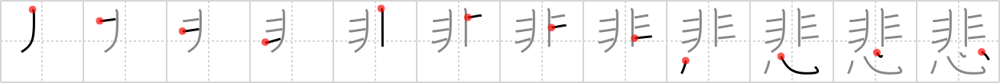

# {悲}

## `sad`

## Strokes: 12

## Reading:

### On-Yomi: ヒ &mdash; Kun-Yomi: かな.しい、かな.しむ

### Examples: 悲しい (かな.しい), 悲しむ (かな.しむ)

## Words:

悲観(ひかん): pessimism, disappointment

悲惨(ひさん): misery

悲鳴(ひめい): shriek, scream

悲しむ(かなしむ): be sad, mourn for, regret

悲劇(ひげき): tragedy

悲しい(かなしい): sad
