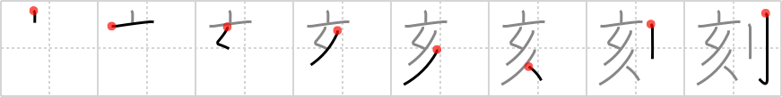

## `engrave`

## [8]

## Reading:

### On-Yomi: コク &mdash; Kun-Yomi: きざ.む、きざ.み

## Heisig story:

Acorn . . . saber.

## Koohii stories:

1) [<a href="http://kanji.koohii.com/profile/fuaburisu">fuaburisu</a>] 15-4-2008(199): This famous ninja (I always use ninjas with <em>sabres</em>, distinct from samurai) used to<strong> engrave</strong> the kanji for his name onto <em>acorns</em>, and throw the <em>acorns</em> to distract his enemies. The legend goes that by the time his victims would pick up the <em>acorn</em> and read the<strong> engrave</strong>d kanji, they were already dead.

2) [<a href="http://kanji.koohii.com/profile/rgravina">rgravina</a>] 3-8-2006(76): While it&#039;s traditional for lovers to<strong> engrave</strong> their names on a tree in many countries, in Japan, however, it was traditional for a samurai to signify his undying love for a woman by engraving the kanji of her name on an <em>acorn</em> with his <em>sabre</em>.

3) [<a href="http://kanji.koohii.com/profile/DavidZ">DavidZ</a>] 17-10-2009(20): TIP: This also means &quot;time&quot;... STORY: The Swiss watchmaker is a master<strong> engrave</strong>r. He<strong> engrave</strong>s the minutes and seconds on an <em>acorn</em> using a tiny <em>saber</em> to make a miniature cuckoo clock... 遅刻 [ちこく].

4) [<a href="http://kanji.koohii.com/profile/sweetneet">sweetneet</a>] 14-8-2006(19): Whenever i think of &quot;engraving&quot; i think of wedding invitations. :) well there&#039;s this one bride who wanted to be unique, so rather than on paper, she decided to<strong> engrave</strong> their wedding invitations on an <em>acorn</em> with a <em>sabre</em>, and give that out to their guests. (Not true story, but with brides&#039; crazy ideas these days, I wouldn&#039;t be surprised...) :-).

5) [<a href="http://kanji.koohii.com/profile/Virtua_Leaf">Virtua_Leaf</a>] 9-1-2008(17): Just picture Zorro using his <em>saber</em> to<strong> engrave</strong> his name out on a giant <em>acorn</em>.

6) [<a href="http://kanji.koohii.com/profile/leafy_tree">leafy_tree</a>] 8-6-2009(13): Most people use a knife to<strong> engrave</strong> their lover&#039;s name on a tree. However, this nutty guy is using a sabre to<strong> engrave</strong> his lover&#039;s name into an acorn with the hopes it will grow into a great oak bearing her name.

7) [<a href="http://kanji.koohii.com/profile/rtkrtk">rtkrtk</a>] 23-1-2008(12): The army of hogs has the <em>sign of the hog</em> (in the shape of an <em>acorn</em>)<strong> engrave</strong>d on their <em>saber</em>s. Don&#039;t confuse with inscription, which is a name; an engraving is not a name.

8) [<a href="http://kanji.koohii.com/profile/stupiddog">stupiddog</a>] 30-12-2009(8): I kept messing this up with <a href="../275">inscription</a> (#275 銘). It helps to<strong> engrave</strong> something other into the <em>acorn</em> with your <em>sabre</em>, like time: 刻一刻 【こくいっこく】 (adv) moment by moment; hour by hour. This tells the story of the bored ninja who<strong> engrave</strong>s a stroke into an <em>acorn</em> with his <em>sabre</em> for every boring moment that has passed while waiting for the enemy to arrive.

9) [<a href="http://kanji.koohii.com/profile/knightx12001">knightx12001</a>] 19-2-2009(7): You are ENGRAVING an ACORN in your SABER.

10) [<a href="http://kanji.koohii.com/profile/Zarxrax">Zarxrax</a>] 6-6-2008(7): This fellow in Japan makes a living by selling acorns where he has used a little saber to<strong> engrave</strong> peoples name on. Unfortunately its not a skill that&#039;s in very high demand these days...
