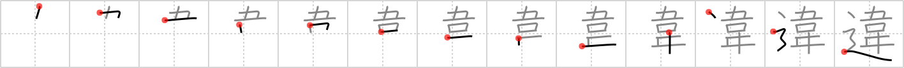

## `difference`

## [13]

## Reading:

### On-Yomi: イ &mdash; Kun-Yomi: ちが.う、ちが.い、ちが.える、-ちが.える、たが.う、たが.える

### Examples: 違う (ちが.う), 違える (ちが.える)

## Words:

行き違い(いきちがい): misunderstanding, estrangement, disagreement, crossing without meeting, going astray

食い違う(くいちがう): to cross each other, to run counter to, to differ, to clash, to go awry

擦れ違い(すれちがい): chance encounter

すれ違う(すれちがう): to pass by one another, to disagree, to miss each other

違える(ちがえる): to change

間違う(まちがう): to make a mistake, to be incorrect, to be mistaken

違反(いはん): violation (of law), transgression

勘違い(かんちがい): misunderstanding, wrong guess

相違(そうい): difference, discrepancy, variation

違い(ちがい): difference, discrepancy

違いない(ちがいない): sure, no mistaking it, for certain

間違い(まちがい): mistake

間違える(まちがえる): make a mistake

違う(ちがう): differ (from)

## Koohii stories:

1) [<a href="http://kanji.koohii.com/profile/sweetneet">sweetneet</a>] 30-8-2006(221): You lose your precious <em>locket</em> on the <em>road</em> to somewhere. You ask people if they&#039;ve seen it, but no luck. &quot;Just buy another one,&quot; someone says. &quot;I mean, what&#039;s the<strong> difference</strong>?&quot; Then of course you say &quot;Well, it makes a huge<strong> difference</strong>!! Since it has sentimental value, I don&#039;t want a different one! &quot; Then of course they understand. 

2) [<a href="http://kanji.koohii.com/profile/romanrozhok">romanrozhok</a>] 17-2-2008(68): You loose your LOCKET on the ROAD and report it to the   <a href="http://jisho.org/kanji/details/交番">交番</a>  . They find one, and show it to you. 「これですか？」 But it&#039;s the wrong one... You say, 「いいえ。。<strong>違います</strong>。。」. 

3) [<a href="http://kanji.koohii.com/profile/mcfate">mcfate</a>] 6-9-2007(46): An odd version of The Road Less Traveled: &quot;I found a <em>locket</em> in the <em>road</em>, and that has made all the<strong> difference</strong>.&quot;. 

4) [<a href="http://kanji.koohii.com/profile/desmidus">desmidus</a>] 4-8-2008(36): You know what the<strong> difference</strong> is between you and me? I find this expensive locket on the road and I look for the owner. You, on the other hand, look for a pawn shop. THAT&#039;s the<strong> difference</strong>. 

5) [<a href="http://kanji.koohii.com/profile/Johnnyltn">Johnnyltn</a>] 21-9-2006(21): Noticing a<strong> difference</strong> between the <em>locket</em> hanging around his lover&#039;s neck and the <em>locket</em> he had giver her he rips it off her and throws it in the <em>road</em>. 

6) [<a href="http://kanji.koohii.com/profile/Joyo1945">Joyo1945</a>] 8-6-2009(17): The<strong> difference</strong> between a <em>locket</em> and a <em>road</em> is a locket is a path to a memory, not a place. 

7) [<a href="http://kanji.koohii.com/profile/kanjihito">kanjihito</a>] 9-7-2011(6): Living on the <em>road</em>, being given a <em>locket</em> to remember her by made all the<strong> difference</strong>. 

8) [<a href="http://kanji.koohii.com/profile/akatsukigui">akatsukigui</a>] 26-11-2010(6): The<strong> difference</strong> between the <em>locket</em> and the <em>road</em> is that you carry the <em>locket</em> with you while the <em>road</em> is what carries you. 

9) [<a href="http://kanji.koohii.com/profile/Viking101">Viking101</a>] 26-1-2010(6): You are looking at one of those children&#039;s books where you have to spot the<strong> difference</strong> between two similar pictures. The only<strong> difference</strong> between these pictures is that one has a <em>locket</em> in the middle of the <em>road</em>. The other doesn&#039;t. 

10) [<a href="http://kanji.koohii.com/profile/bexinkyushu">bexinkyushu</a>] 15-9-2011(5): Those who walk an <em>eccentric road</em> in life see many a<strong> difference</strong> in the world to your regular joe. Note this kanji most commonly describes mistakes and misunderstandings. The <em>eccentric road</em> is commonly misunderstood by others. 
