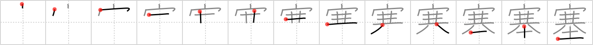

## `block up`

## [13]

## Reading:

### On-Yomi: ソク、サイ &mdash; Kun-Yomi: ふさ.ぐ、とりで、み.ちる

## Heisig story:

House . . . celery . . . animal legs . . . soil.

## Koohii stories:

1) [<a href="http://kanji.koohii.com/profile/Megaqwerty">Megaqwerty</a>] 15-6-2007(124): The A/C wasn&#039;t making the house <em>cold</em> because the filters had been <strong>blocked up</strong> with <em>dirt</em>.

2) [<a href="http://kanji.koohii.com/profile/gavmck">gavmck</a>] 19-3-2010(18): It was so <a href="../v4/1526">cold</a> (#1526 寒), the pipes <strong>blocked up</strong> with ice. After <em>removing the ice</em>, we insulated them with <em>soil</em>.

3) [<a href="http://kanji.koohii.com/profile/Meconium">Meconium</a>] 31-7-2009(6): If you cared enough to<strong> block up</strong> that hole around the edge of the window that lets that <em>cold</em> draft in, it wouldn&#039;t feel so <em>icy</em> in here. It doesn&#039;t matter what you<strong> block up</strong> the hole with, even <em>soil</em> will do! Just do it soon, it&#039;s freezing in here.

4) [<a href="http://kanji.koohii.com/profile/lankydan">lankydan</a>] 13-9-2007(6): <strong>Block up</strong> <em>cold</em> house with <em>dirt</em>.

5) [<a href="http://kanji.koohii.com/profile/stupiddog">stupiddog</a>] 22-9-2011(3): Occurs in heart attack ( 心筋梗塞 ). To prevent it: Get out of the <em>house</em> (do sports!) regulary, eat good things (<em>celery</em> comes to mind) and do not snack between meals (no fast food <em>dirt</em>!) (thanks to dukelexon for the inspiration!).

6) [<a href="http://kanji.koohii.com/profile/herman">herman</a>] 2-1-2009(2): The house became cold because the heater was blocked up with dirt.

7) [<a href="http://kanji.koohii.com/profile/dannyboy4885">dannyboy4885</a>] 24-10-2012(1): It should have been <a href="../v4/1526">cold</a> (#1526 寒), but the pipes were <strong>blocked up</strong> with <em>soil</em> and so all the ice melted away.

8) [<a href="http://kanji.koohii.com/profile/Puchatek">Puchatek</a>] 9-8-2011(): My <em>house</em> was teeming with <em>celeries</em> with <em>animal legs</em> and I had to completely<strong> block up</strong> its entrance to prevent even more <em>celeries</em> with <em>animal legs</em> from getting in. I blocked up the entrance to my <em>house</em> with <em>soil</em>.

9) [<a href="http://kanji.koohii.com/profile/kiwiburner">kiwiburner</a>] 23-4-2013(): I had to<strong> block up</strong> the <em>cold</em> ice with <em>soil</em> because the A/C was in パーワファル　モード.

10) [<a href="http://kanji.koohii.com/profile/tguk911">tguk911</a>] 11-4-2013(): You got a piece of <em>celery</em> from the <em>house</em> salad to<strong> block up</strong> your wind pipe which someone realized and called for help after you fell to the <em>ground</em>.

### {V4: 2214, V6: 1646}
