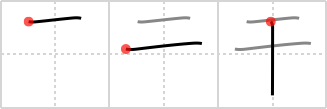

# {1648}

## `dry`

## [3]

## Reading:

### On-Yomi: カン &mdash; Kun-Yomi: ほ.す、ほ.し-、-ぼ.し、ひ.る

### Examples: 干る (ひ.る), 干す (ほ.す)

## Words:

梅干(うめぼし): dried plum

干渉(かんしょう): interference, intervention

若干(じゃっかん): some, few, number of

干し物(ほしもの): dried washing (clothes)

干す(ほす): to air, dry, desiccate, drain (off), drink up
