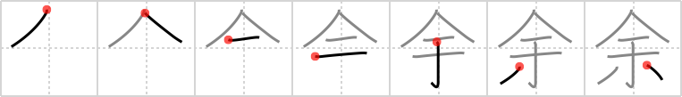

# {余}

## `too much`

## Strokes: 7

## Reading:

### On-Yomi: ヨ &mdash; Kun-Yomi: あま.る、あま.り、あま.す、あんま.り

### Examples: 余す (あま.す), 余る (あま.る)

## Words:

余り(あんまり): not very (this form only used as adverb), not much, remainder, rest, remnant, surplus, balance, excess, remains, scraps, residue, fullness, other, too much

余暇(よか): leisure, leisure time, spare time

余興(よきょう): side show, entertainment

余所見(よそみ): looking away, looking aside

余地(よち): place, room, margin, scope

余程(よっぽど): very, greatly, much, to a large extent, quite

余り(あまり): remainder, remnant, surplus, balance, excess, scraps, residue

余り(あまり): not very, not much

余る(あまる): remain, be left over, be too many

余計(よけい): too much, unnecessary, abundance, surplus, excess

余所(よそ): another place, somewhere else, strange parts

余分(よぶん): extra, excess, surplus

余裕(よゆう): surplus, composure, margin, room, time, allowance, scope, rope
