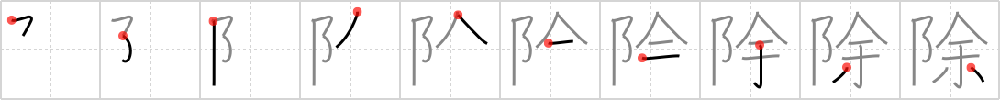

## {1658}

## `exclude`

## [10]

## Reading:

### On-Yomi: ジョ、ジ &mdash; Kun-Yomi: のぞ.く、-よ.け

### Examples: 除外 (じょがい), 除数 (じょすう), 解除 (かいじょ), 除く (のぞ.く)

## Words:

解除(かいじょ): cancellation, rescinding, release, calling off

控除(こうじょ): subsidy, deduction

除外(じょがい): exception, exclusion

取り除く(とりのぞく): to remove, to take away, to set apart

排除(はいじょ): exclusion, removal, rejection

免除(めんじょ): exemption, exoneration, discharge

削除(さくじょ): elimination, cancellation, deletion, erasure

除く(のぞく): remove, exclude

掃除(そうじ): cleaning, sweeping
