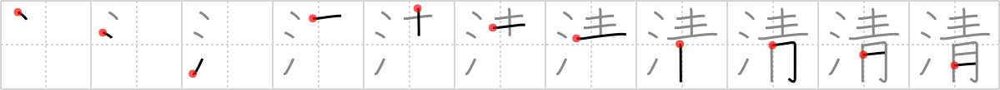

## `pure`

## [11]

## Reading:

### On-Yomi: セイ、ショウ、シン &mdash; Kun-Yomi: きよ.い、きよ.まる、きよ.める

## Heisig story:

Water . . . blue.

## Koohii stories:

1) [<a href="http://kanji.koohii.com/profile/rgravina">rgravina</a>] 16-8-2006(249): <strong>Pure</strong> sea <em>water</em> is always a radiant <em>blue</em>.

2) [<a href="http://kanji.koohii.com/profile/partyrash">partyrash</a>] 4-2-2008(53): Bottles of water claim to be<strong> pure</strong>. They&#039;re generally in blue containers, because blue makes you feel like its that much more<strong> pure</strong>.

3) [<a href="http://kanji.koohii.com/profile/bihzad">bihzad</a>] 16-4-2008(29): <strong>Pure</strong> water is<strong> pure</strong> blue.

4) [<a href="http://kanji.koohii.com/profile/felicitygreen">felicitygreen</a>] 30-3-2006(8): Aristocrats who boast of the purity of their lineage claim to have blue blood, as suggested by the delicate blue veins showing under their pale, thin skin. Here one of them is moved to cut himself, letting a few blue drops out to show the purity of his ancestry, breeding and intentions.

5) [<a href="http://kanji.koohii.com/profile/Thunderball">Thunderball</a>] 17-10-2007(5): You can&#039;t say (せい) that there is anything<strong> pure</strong>r than crystal clear <em>blue water</em> from the ocean.

6) [<a href="http://kanji.koohii.com/profile/Nijuro">Nijuro</a>] 26-7-2010(4): <strong>Pure</strong> <em>water</em> isn&#039;t actually <em>blue</em> like in the ocean… or your toilet.

7) [<a href="http://kanji.koohii.com/profile/paramausi">paramausi</a>] 29-6-2009(4): <strong>Pure</strong> <em>water</em> is <em>blue</em>.

8) [<a href="http://kanji.koohii.com/profile/wasurenaide">wasurenaide</a>] 30-3-2008(4): I think of 清水寺 （きよみずでら）in 京都 when i see this kanji.

9) [<a href="http://kanji.koohii.com/profile/scottamus">scottamus</a>] 21-6-2006(4): Smurf (<a href="../1534">blue</a> (#1534 青)) water is the<strong> pure</strong>st around.

10) [<a href="http://kanji.koohii.com/profile/kanjihito">kanjihito</a>] 15-7-2012(2): <strong>Pure</strong> <em>blue</em> <em>water</em>.
