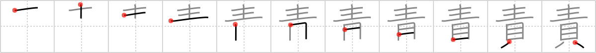

## `blame`

## [11]

## Reading:

### On-Yomi: セキ &mdash; Kun-Yomi: せ.める

## Heisig story:

Grow up . . . oyster.

## Koohii stories:

1) [<a href="http://kanji.koohii.com/profile/Stormchild">Stormchild</a>] 22-2-2007(318): As one <em>grows up</em>, one typically starts to<strong> blame</strong> all of their problems on <em>money</em>.

2) [<a href="http://kanji.koohii.com/profile/akrodha">akrodha</a>] 20-10-2008(79): This is the story of a poor fisherman and his wife. A long time ago he caught an oyster with a small but precious pearl. The intelligent wife told him to sell the pearl immediately: the greedy husband figured if he kept the oyster and fed it, it would grow up and yield an even bigger pearl. One day the <em>oyster grew so big</em>, it crashed through the house and escaped back to sea. The angry wife left her husband, <strong>blaming</strong> his blind greed for their poverty.

3) [<a href="http://kanji.koohii.com/profile/scottamus">scottamus</a>] 21-6-2006(20): Alice (<a href="../v4/1531">poison</a> (#1531 毒))<strong> blame</strong>s her strange adventures on a batch of bad raw oysters.

4) [<a href="http://kanji.koohii.com/profile/felicitygreen">felicitygreen</a>] 30-3-2006(12): Those poor little oysters will never grow up now. And who&#039;s to<strong> blame</strong>? The Walrus and the Carpenter of course.

5) [<a href="http://kanji.koohii.com/profile/scotty28">scotty28</a>] 23-1-2010(9): Peter Pan farts a lot, and he<strong> blame</strong>s it on all the oysters he greedily devours! Tinkerbell says, &quot;Peter, stop blaming the shells and grow up!&quot;.

6) [<a href="http://kanji.koohii.com/profile/HolyKotor">HolyKotor</a>] 1-8-2011(7): <em>Peter Pan</em> <strong>blames</strong> <em>money</em> as the reason adults act so stupid.

7) [<a href="http://kanji.koohii.com/profile/theich">theich</a>] 18-8-2009(6): Die Polizei <strong>zieht jmd. zur Rechenschaft,</strong> der in seinem Keller (Falsch-)<em>Geld</em> (künstliche Muscheln) <em>&quot;wachsen&quot;</em> lässt.

8) [<a href="http://kanji.koohii.com/profile/Perry">Perry</a>] 29-1-2009(6): Don&#039;t<strong> blame</strong> it on the sunshine Don&#039;t<strong> blame</strong> it on the moonlight Don&#039;t<strong> blame</strong> it on the good times<strong> Blame</strong> it on growing up with money.... Primitive = Jackson Five.

9) [<a href="http://kanji.koohii.com/profile/jamiemw">jamiemw</a>] 9-1-2008(5): <em>Alice</em> get<strong> blame</strong>d for spending all the <em>shells</em> on new clothes due to her changing size.

10) [<a href="http://kanji.koohii.com/profile/Shibo">Shibo</a>] 4-6-2008(4): My son says that when he <em>grows up</em>, he wants to be an <em>oyster</em>. My wife, of course,<strong> blame</strong>s me for this..

### {V4: 1541, V6: 1661}
