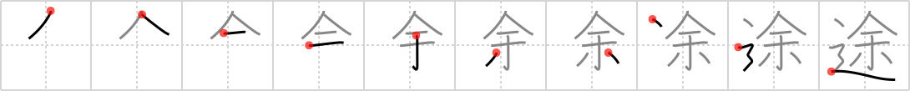

## {1661}

## `route`

## [10]

## Reading:

### On-Yomi: ト &mdash; Kun-Yomi: みち

## Words:

前途(ぜんと): future prospects, outlook, the journey ahead

途中(つちゅう): on the way, en route

途上(とじょう): en route, half way

途絶える(とだえる): to stop, to cease, to come to an end

中途(ちゅうと): in the middle, half-way

途端(とたん): just (now, at the moment, etc.)

用途(ようと): use, usefulness

途中(とちゅう): on the way
