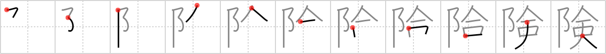

## `precipitous`

## [11]

## Reading:

### On-Yomi: ケン &mdash; Kun-Yomi: けわ.しい

## Heisig V6:

Pinnacle . . . awl.

## Koohii stories:

1) [<a href="http://kanji.koohii.com/profile/dingomick">dingomick</a>] 10-9-2007(203): The edge of <em>The Pinnacle</em> is <strong>precipitous</strong>, so they have a guard posted with an <em>ice pick</em> to poke people and keep them from the edge.

2) [<a href="http://kanji.koohii.com/profile/fuaburisu">fuaburisu</a>] 18-6-2006(30): Well I have someone climbing an inflatable<strong> precipitous</strong> <em>pinnacle</em>. Once at the top it is so<strong> precipitous</strong> that the person is afraid to climb down and instead punctures the inflatable <em>pinnacle</em> with an <em>awl</em> to get safely and slowly back to the ground.

3) [<a href="http://kanji.koohii.com/profile/Floatingweed5">Floatingweed5</a>] 28-11-2007(23): Frankenstein is chased by the villagers up to the<strong> precipitous</strong> edge of the pinnacle. (ref 1671 astridtops).

4) [<a href="http://kanji.koohii.com/profile/dihutenosa">dihutenosa</a>] 16-5-2008(19): The <em>Ice Climbers</em> enjoy<strong> precipitous</strong> climbs - and what better place to climb than the<strong> precipitous</strong> <em>Pinnacle</em>!

5) [<a href="http://kanji.koohii.com/profile/MeisterLlama">MeisterLlama</a>] 8-4-2009(14): The rock climber trying to get up to the pinnacle is dangling from a<strong> precipitous</strong> edge, hanging only one with his icepick.

6) [<a href="http://kanji.koohii.com/profile/dwhiteley">dwhiteley</a>] 4-4-2010(9): Getting to the <em>Pinnacle</em> is a very<strong> precipitous</strong> climb. You need to drive <em>awls</em> into the wall as you climb up.

7) [<a href="http://kanji.koohii.com/profile/esaulgd">esaulgd</a>] 5-5-2008(5): She pushed her enemy off the top of <em>The Pinnacle</em>, and he took a <strong>precipitous</strong> fall into an <em>awl</em> she had set below.

8) [<a href="http://kanji.koohii.com/profile/Immacolata">Immacolata</a>] 6-5-2006(4): The ascend to the Pinnacle is so<strong> precipitous</strong> that you need to chuck awls into the<strong> precipitous</strong> rock to climb up.

9) [<a href="http://kanji.koohii.com/profile/mantixen">mantixen</a>] 9-7-2009(3): It is<strong> precipitous</strong> for a <em>n00b</em> to attempt to reach the <em>pinnacle</em> (see <a href="../1671">sabre/saber</a> (#1671 剣).

10) [<a href="http://kanji.koohii.com/profile/Hawkeye123">Hawkeye123</a>] 9-3-2009(3): They keep an ice wall at <em>The Pinnacle</em> for the goers to climb at leisure using <em>ice picks</em>. It&#039;s very <strong>precipitous</strong>, so it &#039;s quite a dangerous( 危険な ) adventure( 冒険 ).
