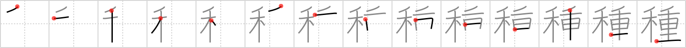

# {種}

## `species`

## Strokes: 14

## Reading:

### On-Yomi: シュ &mdash; Kun-Yomi: たね、-ぐさ

### Examples: 種 (たね)

## Words:

各種(かくしゅ): every kind, all sorts

種々(くさぐさ): variety

種(しゅ): kind, variety, species

品種(ひんしゅ): brand, kind, description

一種(いっしゅ): species, kind, variety

種類(しゅるい): variety, kind, type, category, counter for different sorts of things

人種(じんしゅ): race (of people)

種(たね): seed, kind, variety, quality, tone, material, matter, subject, theme, (news) copy, cause, source, trick, secret, inside story
