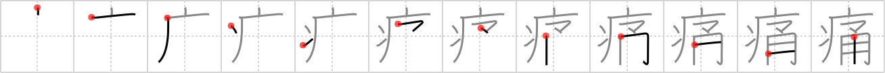

## `pain`

## [12]

## Reading:

### On-Yomi: ツウ &mdash; Kun-Yomi: いた.い、いた.む、いた.ましい、いた.める

## Koohii stories:

1) [<a href="http://kanji.koohii.com/profile/kumakuma">kumakuma</a>] 6-7-2008(192): The CAVEMAN felt such a<strong> pain</strong> after his POGO STICK got stuck in his butt. 

2) [<a href="http://kanji.koohii.com/profile/joesan">joesan</a>] 3-12-2007(44): When I was feeling <em>sick</em> my mum said I shouldn&#039;t go out to play on my <em>pogo stick</em> until I felt better. Well I wasn&#039;t strong enough to stay up on it and so fell over and have the<strong> pain</strong> to prove my mum right. 

3) [<a href="http://kanji.koohii.com/profile/laner36">laner36</a>] 29-10-2007(17): <em>Caveman</em> feels no<strong> pain</strong> (since he was frozen for so long his<strong> pain</strong> sensors are numbed). Here we see some kids using a <em>pogo stick</em> to jump on his hand. 

4) [<a href="http://kanji.koohii.com/profile/rtkrtk">rtkrtk</a>] 14-2-2008(14): Think of the phrase<strong> pain</strong> in the xxx. Then think of a <em>pogostick</em> up your xxx. That&#039;s<strong> pain</strong>ful, right? The real question is why a <em>pogostick</em> is up your xxx. That&#039;s <em>sick</em>, dude. 

5) [<a href="http://kanji.koohii.com/profile/cheechuan">cheechuan</a>] 14-6-2008(11): It causes me great<strong> pain</strong> to <em>utilize</em> my <em>chopseal</em> to pay for all of my wife&#039;s bills due to her shopping <em>sickness</em>. 

6) [<a href="http://kanji.koohii.com/profile/MeisterLlama">MeisterLlama</a>] 9-4-2009(6): When you&#039;re sick, you often have<strong> pain</strong>s in your head, stomach, etc. It feels like an pogostick is hitting those areas over and over. Imagine that is really the source of all<strong> pain</strong> from sickness - invisible pogosticks in your body. 

7) [<a href="http://kanji.koohii.com/profile/romanrozhok">romanrozhok</a>] 12-8-2008(6): Richcoop + rtkrtk = STORY: You go to a doctor and explain to him that the<strong> PAIN</strong> in your a$$ is not because you are SICK but because you missed your footing on the POGO STICK and it went right up your a$$!!!　. 

8) [<a href="http://kanji.koohii.com/profile/Chaze">Chaze</a>] 20-1-2011(5): ♪ Let&#039;s have some fun, this<strong> pain</strong> is <em>sick</em> / I wanna have a ride on your <em>pogo stick</em>. 

9) [<a href="http://kanji.koohii.com/profile/einahpets">einahpets</a>] 14-2-2012(4): When she&#039;s in<strong> pain</strong> from a <em>sickness, Ma (マ) utilizes</em><strong> pain</strong>killers. 

10) [<a href="http://kanji.koohii.com/profile/Ricardo">Ricardo</a>] 9-6-2007(4): [pain; hurt; damage; bruise] If you have a <em>sickness</em> that gives you the worst <strong>pain</strong> you ever had, you&#039;ll want a <em>chopper</em> to take you to the hospital as fast as possible! 
