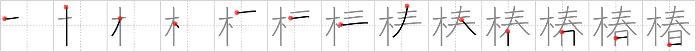

## `camellia`

## [13]

## Reading:

### On-Yomi: チン、チュン &mdash; Kun-Yomi: つばき

## Heisig story:

Tree . . . springtime.

## Koohii stories:

1) [<a href="http://kanji.koohii.com/profile/Johnnyltn">Johnnyltn</a>] 14-3-2007(280): The <em>tree</em> of <em>spring</em>. Fact: <strong>Camellia</strong> are highly valued in Japan and elsewhere for their very early flowering, often among the first flowers to appear in the late winter [early spring?].

2) [<a href="http://kanji.koohii.com/profile/dingomick">dingomick</a>] 5-3-2007(43): Anyone who&#039;s lived in Japan knows <strong>camellia</strong> are by far the first tree of spring to flower. And how can you miss those shockingly pink flowers!

3) [<a href="http://kanji.koohii.com/profile/theasianpleaser">theasianpleaser</a>] 2-1-2009(14): The<strong> camellia</strong> <em>tree</em> got its name from all the chameleons that cover every part of it during the <em>spring</em>.

4) [<a href="http://kanji.koohii.com/profile/kanjihito">kanjihito</a>] 23-4-2012(8): The<strong> camellia</strong> is the <em>tree</em> which brings out its own <em>springtime</em>, even when it&#039;s not springtime, as it blooms around January.

5) [<a href="http://kanji.koohii.com/profile/sskaggs">sskaggs</a>] 22-10-2011(5): The<strong> camellia</strong> is the famous <em>tree</em> you see blooming in early <em>spring</em>, and also, the<strong> camellia</strong> is taken from its <em>tree</em> to be used in &quot;flowering tea,&quot; as a small way to bring <em>spring</em> into your tea breaks. ---- Ways you&#039;ve seen<strong> camellia</strong>s that may help memorization: the tree called C. Japonica is in the<strong> camellia</strong> family, flowering teas (where the tea in sewn to a<strong> camellia</strong> flower which &quot;blooms&quot; when brewed, and this kanji is read as つばき, which is a very common anime name. similar <a href="../927">chrysanthemum</a> (#927 菊), <a href="../1210">wisteria</a> (#1210 藤).

6) [<a href="http://kanji.koohii.com/profile/shuusaku">shuusaku</a>] 22-2-2010(5): <strong>CAMELLIA</strong> is the TREE that signals with its flowers the arrival of SPRINGTIME.

7) [<a href="http://kanji.koohii.com/profile/greenapple">greenapple</a>] 6-6-2006(4): The springtime tree. I sit with Camelia, my girlfriend, under it in Spring.

8) [<a href="http://kanji.koohii.com/profile/lecz0r">lecz0r</a>] 27-1-2011(3): <strong>CAMELLIA</strong> are the first TREE of SPRING.

9) [<a href="http://kanji.koohii.com/profile/erikkusan">erikkusan</a>] 15-3-2006(2): There also are two theories on why the present kanji (Chinese) character (which is a combination of the symbols for &quot;tree&quot; and &quot;spring&quot;) came to be used to mean &quot;Camellia&quot;. First theory says it is a Japanese invention to connote that<strong> camellia</strong> brings spring. The other says that it was borrowed from the Chinese character &quot;zhuang&quot; which originally signified another sacred deciduous tree &quot;Chinaberry&quot; to stand for<strong> camellia</strong> in Japan. <a href="http://www.shiseido.co.jp/e/e9803kor/html/text/kor05202.htm">http://www.shiseido.co.jp/e/e9803kor/html/text/kor05202.htm</a>.

10) [<a href="http://kanji.koohii.com/profile/KanjiHantaa">KanjiHantaa</a>] 2-4-2013(1): Quienes viven en Japón saben que la <strong>camelia</strong> es el primer <em>árbol</em> en anunciar la <em>primavera</em>.
