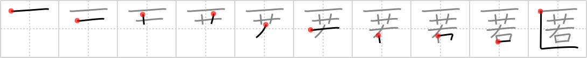

## `hide`

## [10]

## Reading:

### On-Yomi: トク &mdash; Kun-Yomi: かくま.う

## Heisig story:

Box . . . young.

## Premitive:

box 1 This enclosure, open at the right, represents a box lying on its side. When it is not used as an enclosure, its form is cramped to look like this: ≫. You may distinguish its meaning by picturing it then as a very small box. [2]

## Koohii stories:

1) [<a href="http://kanji.koohii.com/profile/dingomick">dingomick</a>] 8-3-2007(280): <em>Young</em> kids likes to <strong>hide</strong> in <em>cardboard boxes</em>. (Primitive: <em>CARDBOARD BOX</em>, especially kids playing with them.).

2) [<a href="http://kanji.koohii.com/profile/RoboTact">RoboTact</a>] 28-7-2007(61): Note that stroke order with <em>box</em> primitive is as follows: first horizontal line, then enclosed element, and then a hook (it&#039;s incorrect in 4th edition).

3) [<a href="http://kanji.koohii.com/profile/Cheesemaster64">Cheesemaster64</a>] 10-6-2009(35): This kanji doesn&#039;t really mean <strong>hide</strong> in the sense of<strong> hide</strong> and seek. It is more towards the meaning of hiding one&#039;s identity. --------------------------AKA <strong>anonymity</strong>----------- Schools are getting so strict now about personal identity, that they make <em>young</em> children keep <strong>anonymity</strong> by making them wear <em>cardboard</em> boxes over there heads.

4) [<a href="http://kanji.koohii.com/profile/Zarxrax">Zarxrax</a>] 12-6-2008(16): Primitive = Solid Snake. <em>Solid Snake</em><strong> hide</strong>s in a <em>cardboard box</em> so he wont be detected. He&#039;s loved hiding in boxes ever since he was <em>young</em>.

5) [<a href="http://kanji.koohii.com/profile/ghinzdra">ghinzdra</a>] 3-5-2008(5): When I was YOUNG I used to play to<strong> hide</strong> and seek ....Everything was good for that : even and old BOX . I was quite innocent at that time .... Later I learned games of adult : especially lies and conceal one&#039;s feelings.... NB : In order to avoid confusion with <a href="../1313">conceal</a> (#1313 隠)<strong> hide</strong> is given a material meaning while conceal will be more intellectual .... The background of youth strenghten this conception.

6) [<a href="http://kanji.koohii.com/profile/thegeezer3">thegeezer3</a>] 13-6-2007(4): For my primitive of cardbox im going to use oscar from sesame street but he now lives in a cardboard box in london - homeless after the end of sesame street and even more bitter and miserable. Hes always swearing and reading porn (centerfolds are pinned up in his box) and has become an alchi.) Oscar up to his old tricks as usual hiding in the box and then scaring the crap out of the young kisd that poke their noses into his box. Yes oscars becoming even more miserable and bitter since being fired.

7) [<a href="http://kanji.koohii.com/profile/blaked569">blaked569</a>] 3-7-2009(3): When Snake was <em>young</em>, he liked to<strong> hide</strong> in cardboard <em>boxes</em> (Old Snake prefers to roll around in steel drums).

8) [<a href="http://kanji.koohii.com/profile/ivantolearnkanji">ivantolearnkanji</a>] 2-5-2008(3): I have a cardboard box containing all of the artifacts from when I was young (yearbooks, letters from high-school romances and the like) that I<strong> hide</strong> from everyone.

9) [<a href="http://kanji.koohii.com/profile/jonusbalonus">jonusbalonus</a>] 21-5-2013(2): To<strong> hide</strong> in a <em>cardboard box</em> is great fun... when you are <em>young</em>.

10) [<a href="http://kanji.koohii.com/profile/sskaggs">sskaggs</a>] 13-8-2011(2): Is there any creature on this planet that likes to<strong> hide</strong> in a sideways <em>box</em> more than <em>young</em> kittens? There&#039;s no way you can&#039;t think of a cute fuzzy kitten playing<strong> hide</strong> and seek in a sideways <em>box</em>.
