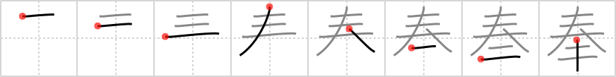

## `dedicate`

## [8]

## Reading:

### On-Yomi: ホウ、ブ &mdash; Kun-Yomi: たてまつ.る、まつ.る、ほう.ずる

## Heisig story:

<i>Bonsai</i> . . . <i>cornstalk</i>. Use a ritualistic, religious meaning.

## Premitive:

cornstalk The element for bushes extended the vertical stroke beneath the final horizontal stroke; the cornstalk omits that final stroke altogether, leaving only the stalk and the leaves bursting forth on all sides. [3]

## Koohii stories:

1) [<a href="http://kanji.koohii.com/profile/dingomick">dingomick</a>] 26-4-2007(213): To join the temple, you have to <strong>dedicate</strong> yourself to raising <em>bonsai</em> for enlightenment, and <em>cornstalks</em> for sustenance.

2) [<a href="http://kanji.koohii.com/profile/fuaburisu">fuaburisu</a>] 23-4-2006(61): A Japanese farmer who was growing <em>corn</em> tried to<strong> dedicate</strong> himself to the god of <em>corn</em> (in the hope it would bring better harvests). He had a little room with prayer beads, incense, etc. One day he brought an offerand that he thought would please the god of <em>corn</em> : a <em>bonsai - corn</em> (a <em>corn</em> plant turned into a <em>bonsai</em>). The god was infuriated and yelled at him &quot;HOW DARE YOU TORTURE MY CORN IN SUCH WAYS!&quot;. The End.

3) [<a href="http://kanji.koohii.com/profile/theasianpleaser">theasianpleaser</a>] 8-12-2008(42): I used <em>does not equal</em> for the primitve(slant the line as a slash through the &quot;equals&quot; sign). Story: Decorating a <em>bonsai tree</em> for Christmas <em>does not equal</em> an <strong>observance</strong> of the real meaning of Christmas. Just like most people who<strong> dedicate</strong> themselves to appeasing the Credit Card gods for Christmas. Just <em>dosen&#039;t equal</em> the Christmas I know of.

4) [<a href="http://kanji.koohii.com/profile/drivers99">drivers99</a>] 14-8-2009(34): You have to be really<strong> dedicate</strong>d to make a <em>bonsai tree</em> out of a <em>cornstalk</em>.

5) [<a href="http://kanji.koohii.com/profile/Stormchild">Stormchild</a>] 11-4-2007(16): Once a year, the Japanese decorate bonsai trees with miniature cornstalks, and<strong> dedicate</strong> them to the Ainu, the indigenous people of Japan. (For the record, I completely made that up, and I don&#039;t think corn has anything to do with Ainu, except that it reminds me of natives).

6) [<a href="http://kanji.koohii.com/profile/wrightak">wrightak</a>] 2-5-2007(10): I went to a temple in Kamakura and I noticed this kanji in the word 奉納 (ほうのう) inscribed beneath a pair of stone guardian dogs ( 狛犬 こまいぬ). Someone had bought the two dogs and <strong>dedicated</strong> them to the temple (very expensive thing to do). The word 奉納 stood out because it was written in red, which means that the person who bought the dogs is still alive.

7) [<a href="http://kanji.koohii.com/profile/dontpokebadgers">dontpokebadgers</a>] 16-8-2011(7): The bonzai key (キ) is dedication.

8) [<a href="http://kanji.koohii.com/profile/mickymay">mickymay</a>] 25-4-2012(6): I think KEY for キ is a better primitive. I cannot picture a Japanese monk planting corn! dontpokebadgers&#039; story sticks: The Key to the art of bonzai is DEDICATION.

9) [<a href="http://kanji.koohii.com/profile/cameron_en">cameron_en</a>] 25-10-2008(5): This <em>bonsai</em> looks awesome, I&#039;m going to<strong> dedicate</strong> it to <em>Korn</em>.

10) [<a href="http://kanji.koohii.com/profile/astridtops">astridtops</a>] 27-9-2006(5): If you want to turn a <em>cornstalk</em> into a <em>bonsai cornstalk</em>, you&#039;d better be very<strong> dedicate</strong>d to the art of making bonsais...

### {V4: 1573, V6: 1695}
