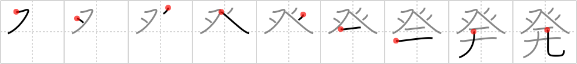

# {1705}

## `discharge`

## [9]

## Reading:

### On-Yomi: ハツ、ホツ &mdash; Kun-Yomi: た.つ、あば.く、おこ.る、つか.わす、はな.つ

### Examples: 発明 (はつめい), 発射 (はっしゃ), 突発 (とっぱつ)

## Words:

開発(かいはつ): development, exploitation

活発(かっぱつ): vigor, active

再発(さいはつ): return, relapse, reoccurrence

始発(しはつ): first train

発(はつ): departure, beginning, counter for gunshots

発育(はついく): (physical) growth, development

発芽(はつが): burgeoning

発掘(はっくつ): excavation, exhumation

発言(はつげん): utterance, speech, proposal

発生(はっせい): outbreak, spring forth, occurrence, incidence, origin

発足(はっそく): starting, inauguration

発病(はつびょう): attack (disease)

発条(ばね): spring (e.g. coil leaf)

反発(はんぱつ): repelling, rebound, recover, oppose

発作(ほっさ): fit, spasm

蒸発(じょうはつ): evaporation, unexplained disappearance

発つ(たつ): depart (on a plane, train, etc.)

爆発(ばくはつ): explosion, detonation, eruption

発揮(はっき): exhibition, demonstration, utilization, display

発見(はっけん): discovery, detection, finding

発行(はっこう): issue (publications)

発車(はっしゃ): departure of a vehicle

発射(はっしゃ): firing, shooting, discharge, catapult

発想(はっそう): expression (music), conceptualization

発達(はったつ): development, growth

発展(はってん): development, growth

発電(はつでん): generation (e.g. power)

発売(はつばい): sale

発表(はっぴょう): announcement, publication

発明(はつめい): invention

出発(しゅっぱつ): depart

発音(はつおん): pronunciation
