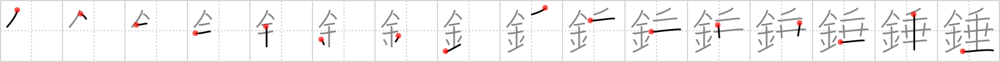

## `spindle`

## [16]

## Reading:

### On-Yomi: スイ &mdash; Kun-Yomi: つむ、おもり

## Heisig story:

Metal . . . droop.

## Koohii stories:

1) [<a href="http://kanji.koohii.com/profile/fiminor">fiminor</a>] 17-7-2006(280): Wasn&#039;t it a cursed<strong> spindle</strong> that Sleeping Beauty pricked her finger on? Therefore the<strong> spindle</strong> was the <em>metal</em> that caused her to <em>droop</em> and eventually sleep for 100 years.

2) [<a href="http://kanji.koohii.com/profile/Avispa">Avispa</a>] 10-10-2007(61): <strong>Spindle</strong>: the needle that drops on an LP record player. This is made of metal. It droops. Viola.

3) [<a href="http://kanji.koohii.com/profile/dingomick">dingomick</a>] 6-9-2007(51): Think of a <strong>plumb bob</strong> rather than <strong>spindle</strong> (which are the same shape, and this kanji means both). It&#039;s a perfectly literal kanji: <em>droop</em>ing <em>metal</em>.

4) [<a href="http://kanji.koohii.com/profile/elmaestrokgb">elmaestrokgb</a>] 20-7-2009(16): Once people could buy whole<strong> spindle</strong>s of CD-Roms for a few bucks, the number of <em>gold</em> records really started to <em>droop</em>.

5) [<a href="http://kanji.koohii.com/profile/CharleyGarrett">CharleyGarrett</a>] 8-2-2007(6): I love this one! It&#039;s a classic cartoon episode! The theiving wolf takes the <em>golden</em> <strong>spindle</strong>. Then <em>Droopy Dog</em> takes the <strong>spindle</strong> away from him, thwaks him on the head with it and rolls him up on it.

6) [<a href="http://kanji.koohii.com/profile/Hoticehunter">Hoticehunter</a>] 23-2-2012(5): One of the kanji removed from Joyo status in 2010. Still worth learning, but make note that you wont see it all that often.

7) [<a href="http://kanji.koohii.com/profile/eri401">eri401</a>] 1-7-2011(4): Sleeping Beauty&#039;s eyes are starting to 垂 <a href="../v4/1582">droop</a> (#1582 垂) cause she&#039;s 睡 <a href="../v4/1583">drowsy</a> (#1583 睡). It is all because of that <em>gold</em><strong> spindle</strong> that she&#039;s drooping like this. Soon, <a href="../v4/472">briar</a> (#472 茨) Rose will sleep under the flowers for the next 100 years. Be careful - she should&#039;ve known it wasn&#039;t a<strong> spindle</strong> actually used for 紡 <a href="../v4/1357">spinning</a> (#1357 紡)! (rare kanji).

8) [<a href="http://kanji.koohii.com/profile/gorgon">gorgon</a>] 2-3-2006(4): A shiny <em>metal</em><strong> spindle</strong> from which a long line of wool or yarn runs to the weaving machine, the wool <em>droop</em>s a little, making a graceful arc, because the line is so long and the wool cannot be kept too taught or it stretches.

9) [<a href="http://kanji.koohii.com/profile/Boy.pockets">Boy.pockets</a>] 12-12-2010(3): The<em> metal</em> had been used as a<strong> spindle</strong> for so long that now it was <em>drooping</em> under the years of service.

10) [<a href="http://kanji.koohii.com/profile/zwarte_kat">zwarte_kat</a>] 15-2-2009(3): Droopy has a (cd-rom)<strong> spindle</strong> of copied cds, calling it; Droopy&#039;s golden hit collection.

### {V4: 1584, V6: 1708}
