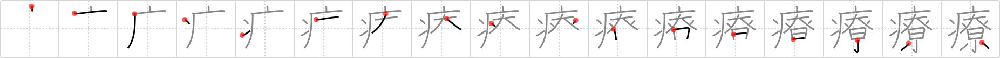

# {1709}

## `heal`

## [17]

## Reading:

### On-Yomi: リョウ

## Words:

診療(しんりょう): medical examination and treatment, diagnosis

治療(ちりょう): medical treatment

医療(いりょう): medical care, medical treatment
