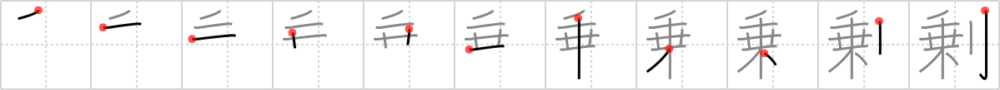

## `surplus`

## [11]

## Reading:

### On-Yomi: ジョウ &mdash; Kun-Yomi: あまつさえ、あま.り、あま.る

## Heisig story:

Ride . . . saber.

## Koohii stories:

1) [<a href="http://kanji.koohii.com/profile/mcfate">mcfate</a>] 17-5-2008(118): If you go for a <em>ride</em> and find a <em>saber</em> beside you, perhaps you got into an Army<strong> surplus</strong> jeep.

2) [<a href="http://kanji.koohii.com/profile/radical_tyro">radical_tyro</a>] 7-7-2007(88): Recall the wheat sabers we made a <a href="../906">profit</a> (#906 利) off. We made too many and now there&#039;s<strong> surplus</strong>, for sale on this hay <em>ride</em>.

3) [<a href="http://kanji.koohii.com/profile/dingomick">dingomick</a>] 8-3-2007(75): We got a <strong>surplus</strong> of people on the <em>hayride</em>. <em>Chop</em> &#039;em off.

4) [<a href="http://kanji.koohii.com/profile/Asriel">Asriel</a>] 9-7-2009(31): If there is a<strong> surplus</strong> of people on the <em>ride,</em> they may just need to get rid of a few passengers using a <em>saber</em>.

5) [<a href="http://kanji.koohii.com/profile/Tzadeck">Tzadeck</a>] 13-8-2009(25): Hey, wanna take a <em>ride</em> with me to the Army<strong> surplus</strong> store to buy a <em>saber</em>?

6) [<a href="http://kanji.koohii.com/profile/lifeflaw">lifeflaw</a>] 23-3-2009(13): If trading <em>wheat</em> and <em>sword</em>s lead to 利 <a href="../906">profit</a> (#906 利), then adding <em>silage</em> to your trade will lead to a<strong> surplus</strong>...

7) [<a href="http://kanji.koohii.com/profile/aniseed">aniseed</a>] 17-1-2009(9): Cloud (from FF VII) wanted to go on the <em>ride</em> but he wasn&#039;t allowed due to the<strong> surplus</strong> weight caused by his gigantic <em>saber</em> . (based on slats70).

8) [<a href="http://kanji.koohii.com/profile/Proxx">Proxx</a>] 28-9-2008(9): Imagine a horde of Samurai <em>riding</em> the trains in Tokyo instead of businessmen. No longer a <strong>surplus</strong> of mobile phones but definitely of <em>sabres</em>!

9) [<a href="http://kanji.koohii.com/profile/KanjiVirtuoso">KanjiVirtuoso</a>] 20-4-2012(6): What a bumper crop! We made a huge <em>profit</em> (<a href="../906">profit</a> (#906 利)) and had so much<strong> surplus</strong> wheat we had to convert it to <em>silage</em>.

10) [<a href="http://kanji.koohii.com/profile/uberclimber">uberclimber</a>] 23-12-2010(4): Remember the <em>wheat</em> we cut with scythes (farmer&#039;s equivalent of a <em>saber</em>) for <a href="../906">profit</a> (#906 利)?　Well, we harvested too much and have to use the<strong> surplus</strong> for <em>silage</em>. 過剰 (かじょう) : excess.
