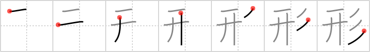

## {1711}

## `shape`

## [7]

## Reading:

### On-Yomi: ケイ、ギョウ &mdash; Kun-Yomi: かた、-がた、かたち、なり

### Examples: 形態 (けいたい), 形成 (けいせい), 図形 (ずけい), 形 (かた), 形 (かたち)

## Words:

形成(けいせい): formation

形勢(けいせい): condition, situation, prospects

形態(けいたい): form, shape, figure

原形(げんけい): original form, base form

地形(じぎょう): terrain, geographical features, topography

形式(けいしき): form, formality, format, mathematics expression

形容詞(けいようし): "true" adjective

形容動詞(けいようどうし): adjectival noun, quasi-adjective

図形(ずけい): figure

正方形(せいほうけい): square

長方形(ちょうほうけい): rectangle, oblong

形(かたち): form, shape

人形(にんぎょう): doll
