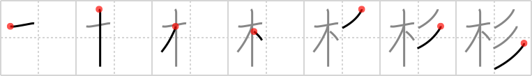

## `cedar`

## [7]

## Reading:

### On-Yomi: サン &mdash; Kun-Yomi: すぎ

## Koohii stories:

1) [<a href="http://kanji.koohii.com/profile/gibosi">gibosi</a>] 5-4-2007(235): <strong>Cedar</strong> is an evergreen tree that keeps its SHAPE all year long. That is, it doesn&#039;t loose its needles/leaves in the winter. 

2) [<a href="http://kanji.koohii.com/profile/Filip">Filip</a>] 29-2-2008(34): Mystique leaning against a<strong> cedar</strong> tree for a photo shoot. 

3) [<a href="http://kanji.koohii.com/profile/MeisterLlama">MeisterLlama</a>] 10-4-2009(24): Why do<strong> cedar</strong> trees keep their shape (don&#039;t lose their needles)? Because they&#039;re not real trees, they&#039;re made out of play-doh. 

4) [<a href="http://kanji.koohii.com/profile/akrodha">akrodha</a>] 31-5-2007(15): Mmmm,<strong> cedar</strong>-scented Play-Doh. Finally, a scent that doesn&#039;t make me want to vomit. 

5) [<a href="http://kanji.koohii.com/profile/aphasiac">aphasiac</a>] 25-10-2009(10): <em>Mystique</em> is leaning against a<strong> cedar</strong> <em>tree</em> for a sexy photo shoot, holding a lump of <em>cheddar</em> (it&#039;s for a cheese advert). 

6) [<a href="http://kanji.koohii.com/profile/ergerg">ergerg</a>] 26-6-2006(5): People keep clothes in wooden<strong> cedar</strong> chests so moths won&#039;t get them. In this case some sweaters were kept in the<strong> cedar</strong> chest for so long that they permanently took on the shape of the chest... 

7) [<a href="http://kanji.koohii.com/profile/hissatsu">hissatsu</a>] 12-8-2010(3): <strong>Cedar</strong> is a <em>wood</em> that keeps its <em>shape</em>. (This is true, it&#039;s rot resistant.). 

8) [<a href="http://kanji.koohii.com/profile/gfb345">gfb345</a>] 12-6-2010(3): The<strong> CEDAR</strong>, the national symbol of Lebanon, is a <em>TREE</em> instantly recognizable by its characteristic <em>SILHOUETTE</em> (=<em>SHAPE</em>), as seen in the Lebanese flag. (Reality check: story aside,   <a href="http://jisho.org/kanji/details/杉">杉</a>   (すぎ) refers to the Japanese<strong> cedar</strong>, <em>Cryptomeria japonica</em>, rather than the Lebanese<strong> cedar</strong>, <em>Cedrus libani</em>, an unrelated species. Cf.   <a href="http://jisho.org/kanji/details/椙">椙</a>   <a href="../2528">cryptomeria</a> (#2528 <a href="http://jisho.org/kanji/details/椙">椙</a>)). 

9) [<a href="http://kanji.koohii.com/profile/thairob">thairob</a>] 8-1-2008(3): BRUCE LEE was actually killed by a<strong> CEDAR</strong> TREE that he was cutting down to make some exercise equipment. The funny thing is they decided to use the<strong> CEDAR</strong> TREE to make the coffin that they buried him in Seattle. True story. 

10) [<a href="http://kanji.koohii.com/profile/Kaame">Kaame</a>] 28-8-2012(2): <strong>Se där</strong>, jag lyckades göra ett <strong>cedar</strong>-<em>träd</em> av <em>modellera</em>. 
