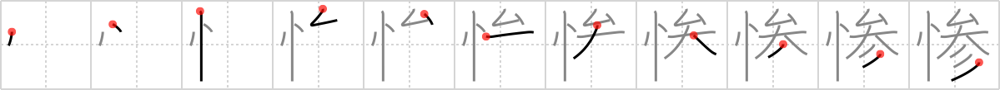

# {惨}

## `wretched`

## Strokes: 11

## Reading:

### On-Yomi: サン、ザン &mdash; Kun-Yomi: みじ.め、いた.む、むご.い

### Examples: 惨劇 (さんげき), 悲惨 (ひさん), 陰惨 (いんさん), 惨め (みじ.め)

## Words:

悲惨(ひさん): misery

惨め(みじめ): miserable
