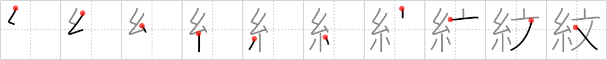

## `family crest`

## [10]

## Reading:

### On-Yomi: モン

## Heisig story:

Thread . . . plaid.

## Koohii stories:

1) [<a href="http://kanji.koohii.com/profile/skinnyneo">skinnyneo</a>] 9-12-2007(168): Who knew that <em>Spiderman</em> was <em>Scottish!</em> He has sewn his<strong> family crest</strong> onto his uniform.

2) [<a href="http://kanji.koohii.com/profile/Raichu">Raichu</a>] 29-3-2007(61): A<strong> family crest</strong> sown on to a garment with <em>thread</em> sometimes has a Latin <em>sentence</em> as a motto.

3) [<a href="http://kanji.koohii.com/profile/romanrozhok">romanrozhok</a>] 23-2-2008(49): If you look closely, you can see that on SPIDERMAN&#039;S CREST, there is sown in his favorite SENTENCE, &quot;with great power, comes great responsibility.&quot;.

4) [<a href="http://kanji.koohii.com/profile/sgrant">sgrant</a>] 8-1-2009(20): On <em>Spiderman&#039;s</em><strong> family crest</strong> reads the <em>sentence</em> &quot;With great power, comes great responsibility&quot;... in Latin of course.

5) [<a href="http://kanji.koohii.com/profile/esaulgd">esaulgd</a>] 11-5-2008(13): The scotsmen proudly display the <strong>family crest</strong> <em>threaded</em> into their <em>kilts</em>.

6) [<a href="http://kanji.koohii.com/profile/brianobush">brianobush</a>] 10-6-2009(4): She had her<strong> family crest</strong> sewn on her <em>plaid</em> <em>brassiere</em>. It adorned her beautiful rack nicely.

7) [<a href="http://kanji.koohii.com/profile/Filip">Filip</a>] 1-3-2008(4): Spiderman his ancestors were actually scottish (thats why he likes redheads). His <strong>family crest</strong> depicts a proud scotsman(imagine him wearing spidertights under his skirt).

8) [<a href="http://kanji.koohii.com/profile/Green_Airplane">Green_Airplane</a>] 7-8-2010(3): <em>Spiderman</em>&#039;s<strong> family crest</strong> is <em>plaid</em> with a single <em>sentence</em>: &quot;With great power comes great responsibility.&quot;.

9) [<a href="http://kanji.koohii.com/profile/fuaburisu">fuaburisu</a>] 23-4-2006(3): This Japanese family who has some Scottish in their ancestors, has their<strong> family crest</strong> woven in fine <em>thread</em> onto a <em>plaid</em>. Picture a<strong> family crest</strong> made of symbols rather than letters so as not to confuse later with <a href="../1828">family name</a> (#1828 氏).

10) [<a href="http://kanji.koohii.com/profile/rucury">rucury</a>] 9-5-2012(2): Not sure if it would help, but, uh... <a href="http://www.crest.com/images/crest-products/large/Crest-Spiderman-Liquid-Gel-Super-Action.png">http://www.crest.com/images/crest-products/large/Crest-Spiderman-Liquid-Gel-Super-Action.png</a>.
