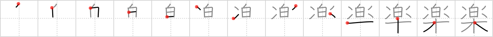

# {楽}

## Strokes: 13

## Reading:

### On-Yomi: ガク、ラク、ゴウ &mdash; Kun-Yomi: たの.しい、たの.しむ、この.む

### Examples: 楽隊 (がくたい), 楽器 (がっき), 音楽 (おんがく), 楽しい (たの.しい), 楽しむ (たの.しむ)

## Words:

楽譜(がくふ): score (music)

気楽(きらく): at ease, comfortable

極楽(ごくらく): paradise

楽しむ(たのしむ): to enjoy oneself

楽観(らっかん): optimism

楽器(がっき): musical instrument

娯楽(ごらく): pleasure, amusement

楽む(たのしむ): enjoyment, pleasure

楽(らく): comfort, ease

楽しみ(たのしみ): pleasure, joy

音楽(おんがく): music, musical movement

楽しい(たのしい): pleasant, enjoyable, fun
