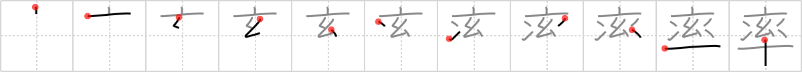

# {1737}

## `ratio`

## [11]

## Reading:

### On-Yomi: ソツ、リツ、シュツ &mdash; Kun-Yomi: ひき.いる

### Examples: 率先 (そっせん), 引率 (いんそつ), 軽率 (けいそつ), 率いる (ひき.いる)

## Words:

軽率(けいそつ): rash, thoughtless, careless, hasty

効率(こうりつ): efficiency

率直(そっちょく): frankness, candour, openheartedness

統率(とうそつ): command, lead, generalship, leadership

倍率(ばいりつ): diameter, magnification

率いる(ひきいる): to lead, to spearhead (a group), to command (troops)

比率(ひりつ): ratio, proportion, percentage

確率(かくりつ): probability

能率(のうりつ): efficiency

率(りつ): rate, ratio, proportion, percentage
