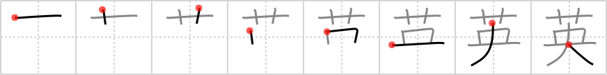

## `England`

## [8]

## Reading:

### On-Yomi: エイ &mdash; Kun-Yomi: はなぶさ

## Koohii stories:

1) [<a href="http://kanji.koohii.com/profile/CharleyGarrett">CharleyGarrett</a>] 11-8-2006(124): The original great seal of the king of <strong>England</strong> had a very ornate <em>flower</em> in the <em>center</em>. 

2) [<a href="http://kanji.koohii.com/profile/kanjihito">kanjihito</a>] 14-9-2010(83): <strong>England</strong> was once the <em>flowering</em> <em>center</em> of civilization. 

3) [<a href="http://kanji.koohii.com/profile/raulir">raulir</a>] 29-12-2006(48): <strong>England</strong> is a country where people think they&#039;re the flower at the center of the world. (a description that would fit China much better..   <a href="http://jisho.org/kanji/details/中華">中華</a>  ). 

4) [<a href="http://kanji.koohii.com/profile/guidedog">guidedog</a>] 25-2-2007(35): <strong>England</strong>, country of flower shows and big, fat dogs (I live in<strong> England</strong>, it&#039;s true). 

5) [<a href="http://kanji.koohii.com/profile/fuaburisu">fuaburisu</a>] 16-10-2005(20): In a rare display of class, the<strong> England</strong> supporters throw <em>flowers</em> at the <em>center</em> of the football stadium. 

6) [<a href="http://kanji.koohii.com/profile/ovioprime">ovioprime</a>] 27-11-2007(15): <strong>England</strong> the center of the world for that finest of flowers, the English rose. 

7) [<a href="http://kanji.koohii.com/profile/mistamark">mistamark</a>] 8-1-2009(13): The<em> flower</em> at the <em>centre</em> of the world is<strong> England</strong> (0 degrees). 

8) [<a href="http://kanji.koohii.com/profile/dihutenosa">dihutenosa</a>] 19-12-2007(11): Your next <em>target</em> -<strong> England</strong>. You can&#039;t seem to remember where it (or anything else) is located on a map (you are, after all, American), but you suddenly remember that<strong> England</strong> is known for its large <em>flowers</em>. There it is, now just line it up... 

9) [<a href="http://kanji.koohii.com/profile/melchan">melchan</a>] 21-7-2009(7): Greenwich Park, the center of the World (0° longitude), covered with flowers. [thanks mistamark]. 

10) [<a href="http://kanji.koohii.com/profile/matticus">matticus</a>] 29-12-2006(5): <strong>England</strong> reminds me of the British comedy Keeping Up Appearances, where Hyacinth is adjusting a bouquet of <em>flowers</em> to make sure it&#039;s in the absolute <em>center</em> of the table. 
