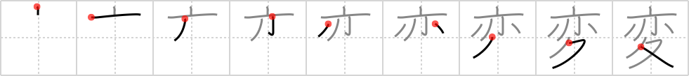

# {変}

## `unusual`

## Strokes: 9

## Reading:

### On-Yomi: ヘン &mdash; Kun-Yomi: か.わる、か.わり、か.える

### Examples: 変える (か.える), 変わる (か.わる)

## Words:

相変わらず(あいかわらず): as ever, as usual, the same

一変(いっぺん): complete change, about-face

変革(へんかく): change, reform, revolution, upheaval, (the) Reformation

変遷(へんせん): change, transition, vicissitudes

変動(へんどう): change, fluctuation

変化(へんか): change, variation, alteration, mutation, transition, transformation, variety, diversity, inflection, declension, conjugation

変更(へんこう): change, modification, alteration

変える(かえる): change

変わる(かわる): change

変(へん): strange
