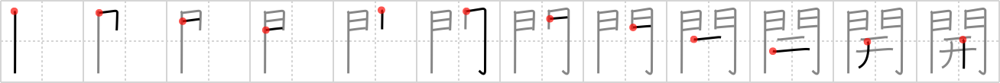

## `open`

## [12]

## Reading:

### On-Yomi: カイ &mdash; Kun-Yomi: ひら.く、ひら.き、-びら.き、ひら.ける、あ.く、あ.ける

## Heisig story:

Gates . . . two hands.

## Koohii stories:

1) [<a href="http://kanji.koohii.com/profile/akrodha">akrodha</a>] 2-6-2007(146): Sure you can squeeze through these <em>gates</em> by kicking them or pushing them with your body, but if you want to get them wide<strong> open</strong>, you need to do that with <em>both your hands</em>.

2) [<a href="http://kanji.koohii.com/profile/shirish">shirish</a>] 3-2-2009(132): To<strong> open</strong> the <em>gate</em>, use your <em>both hands</em>.

3) [<a href="http://kanji.koohii.com/profile/mantixen">mantixen</a>] 27-9-2008(36): The <em>lesbians</em> use <em>both hands</em> to<strong> open</strong> each other&#039;s <em>gates</em>. Sick, but try forgetting this kanji now.

4) [<a href="http://kanji.koohii.com/profile/the_marshal">the_marshal</a>] 26-7-2006(16): Bill gates is entering the major gate of his mansion and needs his two hand in order to<strong> open</strong> the gate. (you would probably think that Bill Gates has an electric door and that&#039;s the case but the conputer that controls it has crashed!).

5) [<a href="http://kanji.koohii.com/profile/torida">torida</a>] 26-5-2010(13): To<strong> open</strong> those big heavy <em>Gates of Hell</em> it takes <em>both hands</em>...

6) [<a href="http://kanji.koohii.com/profile/fuaburisu">fuaburisu</a>] 26-10-2005(11): These are the <em>gates</em> of Ali Baba&#039;s Cave. Instead of saying &quot;open sesame&quot; or something of that effect, Ali Baba has to press his <em>two hands</em> onto some magical artefact that takes care of unlocking the <em>gates</em>. Think about nowadays&#039;s electronic hand or fingerprint recognition. -- This story goes in tandem with the next frame, &quot;closed&quot;.

7) [<a href="http://kanji.koohii.com/profile/romanrozhok">romanrozhok</a>] 16-2-2008(10): Bad ass cowboys<strong> OPEN</strong> salon doors with TWO HANDS. &quot;BAM!&quot;.

8) [<a href="http://kanji.koohii.com/profile/delbertmon">delbertmon</a>] 13-1-2010(4): To keep 開 &amp; 閉 distinct, note the central primitives. The kanji for <a href="../v4/1622">open</a> (#1622 開) 開 has two vertical strokes creating a gap between them, as if they have been pried<strong> open</strong>. The kanji for <a href="../v4/1623">closed</a> (#1623 閉) 閉 only has a single vertical stroke and a diagonal stroke angling toward it keep it shut.

9) [<a href="http://kanji.koohii.com/profile/harusame">harusame</a>] 11-6-2009(3): [I remember<strong> open</strong> and <a href="../v4/1623">closed</a> (#1623 閉) together.]<strong> Open</strong> the <em>gate</em> with <em>both hands</em>. If you can&#039;t get it<strong> open</strong>, it&#039;s probably been closed by a genie, in which case you&#039;ll need to say, &quot;Open sesame!&quot;.

10) [<a href="http://kanji.koohii.com/profile/Robatsu">Robatsu</a>] 14-7-2009(2): Satan forced<strong> OPEN</strong> the <em>gates</em> of hell with his <em>two hands</em> to begin his seige upon the divine realm.

### {V4: 1622, V6: 1750}
